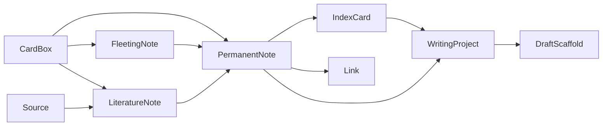

# 研思录领域模型与 Schema 说明 v1.1

## 1. 文档目标

定义 v1.1 核心领域对象、关系和关键业务规则，统一前后端、AI Structured Outputs 与测试语言。

---

## 2. 命名约定

- 内部类型：`FleetingNote / LiteratureNote / PermanentNote`
- UI 展示名：`随笔记录 / 书摘笔记 / 原创笔记`
- Vault / CardBox（内部）在 UI 中统一显示为“目录”
- 面向用户的三棵默认目录树为：随笔目录、书摘目录、原创目录

---

## 3. 领域对象概览

1. CardBox / Directory
2. Source
3. FleetingNote（随笔记录）
4. LiteratureNote（书摘笔记）
5. PermanentNote（原创笔记）
6. IndexCard
7. Link
8. WritingProject
9. DraftScaffold
10. ImportRecord

关系（简化）：

---

## 4. CardBox / Directory

### 定义

CardBox 表示带元数据的本地目录结构（默认目录与子目录）。UI 中统一显示为“目录”。

### 字段

| 字段 | 类型 | 必填 | 说明 |
|---|---|---|---|
| id | string | 是 | 唯一 ID |
| parent_box_id | string | 否 | 父目录 |
| box_type | enum | 是 | 目录类型 |
| title | string | 是 | 名称 |
| fs_path | string | 是 | 本机文件系统路径 |
| is_default | boolean | 是 | 是否默认盒 |
| is_hidden | boolean | 是 | 是否隐藏 |
| max_cards | number | 是 | 最大卡片数，默认 500 |
| created_at | string | 是 | 创建时间 |
| updated_at | string | 是 | 更新时间 |

### box_type 枚举

- fleeting_default
- literature_default
- original_default
- custom

---

## 5. FleetingNote（随笔记录）

### 字段

| 字段 | 类型 | 必填 | 说明 |
|---|---|---|---|
| id | string | 是 | 唯一 ID |
| content_text | string | 否 | 文本内容 |
| voice_asset_path | string | 否 | 语音资产路径 |
| tags | string[] | 否 | 标签 |
| source_hint | string | 否 | 来源提示 |
| is_new | boolean | 是 | 新建未处理标识 |
| converted_to_id | string | 否 | 转换目标 |
| status | enum | 是 | 状态 |
| created_at | string | 是 | 创建时间 |
| updated_at | string | 是 | 更新时间 |

### status 枚举

- inbox
- in_progress
- converted
- archived

规则：
- `content_text` 与 `voice_asset_path` 至少一项非空。
- 超过 7 天未处理内容默认隐藏（查询层规则）。
- 可转换为原创笔记或书摘笔记。
- 转换完成后自动归档，并保留转换链路。

---

## 6. LiteratureNote（书摘笔记）

### 字段

| 字段 | 类型 | 必填 | 说明 |
|---|---|---|---|
| id | string | 是 | 唯一 ID |
| source_id | string | 否 | 对应来源 |
| author_name | string | 是 | 作者 |
| publish_year | string | 是 | 出版年份 |
| book_title | string | 是 | 书名 |
| publisher | string | 是 | 出版社 |
| page_locator | string | 是 | 页码定位 |
| edition_info | string | 否 | 版本信息 |
| translator_or_editor | string | 否 | 译者/编者 |
| quote_text | string | 是 | 摘录 |
| paraphrase_text | string | 是 | 转述 |
| user_question | string | 否 | 问题 |
| topic_candidates | string[] | 否 | 候选主题 |
| linked_permanent_note_ids | string[] | 否 | 关联的原创笔记 |
| status | enum | 是 | 状态 |
| created_at | string | 是 | 创建时间 |
| updated_at | string | 是 | 更新时间 |

### status 枚举

- draft
- ready_for_review
- converted_to_permanent
- archived

规则：
- 书摘笔记可以长期单独存在。
- 从书摘新增原创笔记后，书摘保持原状态，不自动归档或强制改为已转换。
- 书摘通过 `linked_permanent_note_ids` 或 SQLite Link 关系关联原创笔记。

---

## 7. PermanentNote（原创笔记）

### 字段

| 字段 | 类型 | 必填 | 说明 |
|---|---|---|---|
| id | string | 是 | 唯一 ID |
| title | string | 是 | 标题 |
| markdown_body | string | 是 | Markdown 正文 |
| core_claim | string | 是 | 核心观点 |
| rationale | string | 是 | 为什么成立 |
| boundary_or_counterpoint | string | 否 | 边界/反例 |
| citations | Citation[] | 否 | 来源引用 |
| related_index_ids | string[] | 否 | 所属索引 |
| tags | string[] | 否 | 标签 |
| authorship | Authorship | 是 | 作者性信息 |
| originality_status | enum | 是 | 原创性状态 |
| originality_similarity | number | 否 | 与来源内容最高相似度，0..1 |
| status | enum | 是 | 状态 |
| created_at | string | 是 | 创建时间 |
| updated_at | string | 是 | 更新时间 |

### originality_status 枚举

- pass
- warning
- blocked

### status 枚举

- draft
- active
- archived

规则：
- 标题永远取 Markdown 正文第一行。
- 正文中的关联显示为 `[[标题]]`。
- 正文中的标签显示为 `#标签`。
- `originality_similarity >= 0.8` 时禁止保存文件。

---

## 8. IndexCard

- `index_type`: topic / nearby / logic_chain / free_link
- 索引笔记属于“特殊原创笔记”，用于串联主题
- 每个原创目录有独立索引区
- 索引笔记必须保存为 Markdown，同时结构化索引项与排序写入 SQLite。

---

## 9. Link

### relation_type

- supports
- contradicts
- extends
- precedes
- follows
- belongs_to_topic
- associated_with
- appears_in_draft
- free_link

规则：
- 当 relation_type = `free_link` 时，`rationale` 必填。
- 用户界面显示 `[[标题]]`，SQLite 内部保存 `from_note_id -> to_note_id`。
- 标题重名时，候选选择必须绑定确定的 `to_note_id`。

---

## 10. WritingProject / DraftScaffold

规则：
1. 写作流程只允许选择原创目录中的原创笔记或标签。
2. MVP 先生成写作提示词与提纲。
3. 初稿脚手架、段落证据映射与完整正文生成放入后续阶段。

---

## 11. 关键业务规则

1. 原创笔记必须由用户确认，AI 不得自动代写并保存正文。
2. 书摘笔记与原创笔记必须分层，不能混存同一对象。
3. `[[标题]]` 保存时必须解析为显式 Link，并绑定 `note_id`。
4. Backlinks 需按“提及 / 明确关系”展示。
5. 原创笔记净新增每 15 条，触发“整理主题索引”提醒。
6. 所有导入需先预览、再确认，并记录 ImportRecord。
7. 目录树、索引笔记、所有笔记必须保存为 Markdown 文件。
8. 链接关系、标签关系、反向链接、搜索索引与图谱边写入 SQLite。
9. 图谱 MVP 只显示当前目录下笔记之间的链接关系。
10. 写作 MVP 为：选择标签或原创笔记 -> 生成提示词 -> 生成提纲。

---

## 12. Schema 实施建议

1. 保持 `schemas/*.schema.json` 使用内部字段名（fleeting/literature/permanent）。
2. 前端展示名统一通过 i18n 资源映射（中英）。
3. Structured Outputs 必须经 JSON Schema 校验后入库。

