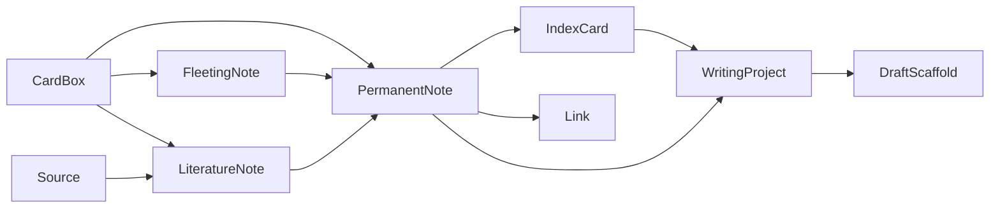

# 研思录领域模型与 Schema 说明 v1.1

## 1. 文档目标

定义当前 MVP 核心领域对象、关系、图谱洞察语义和关键业务规则，统一前后端、AI Structured Outputs 与测试语言。

---

## 2. 命名约定

- 内部类型：`FleetingNote / LiteratureNote / PermanentNote`
- UI 展示名：`随笔记录 / 书摘笔记 / 永久笔记`
- Vault / CardBox（内部）在 UI 中统一显示为“目录”
- 面向用户的三棵默认目录树为：随笔目录、书摘目录、永久笔记目录

---

## 3. 领域对象概览

1. CardBox / Directory
2. Source
3. FleetingNote（随笔记录）
4. LiteratureNote（书摘笔记）
5. PermanentNote（永久笔记）
6. IndexCard
7. Link
8. WritingProject
9. DraftScaffold
10. ImportRecord

关系（简化）：

---

## 4. CardBox / Directory

### 定义

CardBox 表示带元数据的本地目录结构（默认目录与子目录）。UI 中统一显示为“目录”。

### 字段

| 字段 | 类型 | 必填 | 说明 |
|---|---|---|---|
| id | string | 是 | 唯一 ID |
| parent_box_id | string | 否 | 父目录 |
| box_type | enum | 是 | 目录类型 |
| title | string | 是 | 名称 |
| fs_path | string | 是 | 本机文件系统路径 |
| is_default | boolean | 是 | 是否默认盒 |
| is_hidden | boolean | 是 | 是否隐藏 |
| max_cards | number | 是 | 最大卡片数，默认 500 |
| created_at | string | 是 | 创建时间 |
| updated_at | string | 是 | 更新时间 |

### box_type 枚举

- fleeting_default
- literature_default
- original_default
- custom

---

## 5. FleetingNote（随笔记录）

### 字段

| 字段 | 类型 | 必填 | 说明 |
|---|---|---|---|
| id | string | 是 | 唯一 ID |
| content_text | string | 否 | 文本内容 |
| voice_asset_path | string | 否 | 语音资产路径 |
| tags | string[] | 否 | 标签 |
| source_hint | string | 否 | 来源提示 |
| is_new | boolean | 是 | 新建未处理标识 |
| converted_to_id | string | 否 | 转换目标 |
| status | enum | 是 | 状态 |
| created_at | string | 是 | 创建时间 |
| updated_at | string | 是 | 更新时间 |

### status 枚举

- inbox
- in_progress
- converted
- archived

规则：
- `content_text` 与 `voice_asset_path` 至少一项非空。
- 超过 7 天未处理内容默认隐藏（查询层规则）。
- 可转换为永久笔记或书摘笔记。
- 转换完成后自动归档，并保留转换链路。

---

## 6. LiteratureNote（书摘笔记）

### 字段

| 字段 | 类型 | 必填 | 说明 |
|---|---|---|---|
| id | string | 是 | 唯一 ID |
| source_id | string | 否 | 对应来源 |
| source_type | enum | 是 | 来源类型：book / paper / article / web / video / podcast / other |
| source_title | string | 是 | 来源标题；用于生成参考引用时的主标题 |
| container_title | string | 否 | 容器标题，如书名、期刊名、会议名或网站名 |
| author_name | string | 是 | 作者 |
| publish_year | string | 是 | 出版年份 |
| book_title | string | 是 | 书名 |
| publisher | string | 是 | 出版社 |
| page_locator | string | 是 | 页码定位 |
| identifier_text | string | 否 | DOI / ISBN / arXiv / URL 等稳定标识 |
| url_or_path | string | 否 | 原始 URL、PDF 路径或本地附件路径 |
| citation_key | string | 否 | 未来导出参考文献时可复用的引用键 |
| edition_info | string | 否 | 版本信息 |
| translator_or_editor | string | 否 | 译者/编者 |
| quote_text | string | 是 | 摘录 |
| paraphrase_text | string | 是 | 转述 |
| user_question | string | 否 | 问题 |
| topic_candidates | string[] | 否 | 候选主题 |
| linked_permanent_note_ids | string[] | 否 | 关联的永久笔记 |
| status | enum | 是 | 状态 |
| created_at | string | 是 | 创建时间 |
| updated_at | string | 是 | 更新时间 |

### status 枚举

- draft
- ready_for_review
- converted_to_permanent
- archived

规则：
- 书摘笔记可以长期单独存在。
- 从书摘新增永久笔记后，书摘保持原状态，不自动归档或强制改为已转换。
- 书摘通过 `linked_permanent_note_ids` 或 SQLite Link 关系关联永久笔记。
- 书摘笔记是来源层对象，不应在首页主指标与默认搜索排序中压过永久笔记。
- 如果未来要支持一键生成参考引用，书摘笔记在录入阶段就必须保留足够的引用元数据。
- P0 至少要求：`source_type`、`source_title`、`author_name`、`publish_year`、`page_locator`，以及 `identifier_text` 或 `url_or_path` 二选一。
- `container_title`、`publisher`、`edition_info`、`translator_or_editor` 应按来源类型按需填写，避免只留下“摘录正文”而失去引用能力。

---

## 7. PermanentNote（永久笔记）

### 字段

| 字段 | 类型 | 必填 | 说明 |
|---|---|---|---|
| id | string | 是 | 唯一 ID |
| title | string | 是 | 标题 |
| markdown_body | string | 是 | Markdown 正文 |
| core_claim | string | 是 | 核心观点 |
| thesis | string | 否 | 一句话压缩后的核心判断 |
| rationale | string | 是 | 为什么成立 |
| three_line_summary | string[] | 否 | 三句话压缩，依次表达观点、理由与相关性 |
| boundary_or_counterpoint | string | 否 | 边界/反例/反方切口 |
| citations | Citation[] | 否 | 来源引用 |
| related_index_ids | string[] | 否 | 所属索引 |
| tags | string[] | 否 | 标签 |
| authorship | Authorship | 是 | 作者性信息 |
| distillation_status | enum | 否 | 提纯状态 |
| originality_status | enum | 是 | 原创性状态 |
| originality_similarity | number | 否 | 与来源内容最高相似度，0..1 |
| status | enum | 是 | 状态 |
| created_at | string | 是 | 创建时间 |
| updated_at | string | 是 | 更新时间 |

### originality_status 枚举

- pass
- warning
- blocked

### distillation_status 枚举

- missing
- draft
- confirmed

### status 枚举

- draft
- active
- archived

规则：
- 标题永远取 Markdown 正文第一行。
- 正文中的关联显示为 `[[标题]]`。
- 正文中的标签显示为 `#标签`。
- `thesis` 用于把较长正文压缩为一句可复述判断；现阶段实现中可为空，但目标是进入编辑器必填。
- `three_line_summary` 只应在用户确认后保存，不应把 AI 候选静默落库。
- `boundary_or_counterpoint` 应优先记录观点的适用边界、反例、反方意见或容易混淆的概念分界。
- `originality_similarity >= 0.8` 时禁止保存文件。

---

## 8. IndexCard

### index_type

- topic
- nearby
- sequence
- free_link

规则：
- 四类索引是独立对象，不是标签或目录的附属替代物。
- 索引笔记属于“特殊永久笔记”，用于串联主题
- 每个永久笔记目录有独立索引区
- 索引项应尽量带有 `rationale`，解释为什么这条永久笔记被纳入该索引。
- 索引笔记必须保存为 Markdown，同时结构化索引项与排序写入 SQLite。
- 主题索引应逐步支持 `thesis`、`three_line_summary` 与 `central_question`，用于主题级思想压缩。

---

## 9. Link

### relation_type

- supports
- complements
- contrasts
- contradicts
- extends
- precedes
- follows
- qualifies
- example_of
- counterexample_to
- same_topic
- unexpected_connection
- bridges
- restates
- reframes
- appears_in_draft
- belongs_to_topic
- associated_with
- free_link

规则：
- `supports` 与 `contradicts` 属于显式语义关系，图谱层应把它们和普通 wikilink 区分开。
- `same_topic` 与 `unexpected_connection` 用于保留低成熟但有追问价值的语义连接。
- `associated_with` 表示通用关联；仅靠 `[[标题]]` 自动生成的连接默认落在这一类，后续应尽量升级为更明确的关系类型。
- 当 relation_type = `free_link` 时，`rationale` 必填。
- 用户界面显示 `[[标题]]`，SQLite 内部保存 `from_note_id -> to_note_id`。
- 标题重名时，候选选择必须绑定确定的 `to_note_id`。

---

## 10. GraphView / GraphInsight

规则：
1. 图谱 MVP 默认返回目录范围的本地图，不默认打开全局图。
2. 图谱查询结果除了 `nodes` 与 `edges`，还应返回结构洞察：
   - `supporting_relations`
   - `conflicting_relations`
   - `untyped_relations`
   - `bridge_gaps`
3. `supporting_relations` 只统计显式 `supports` 关系，不应把普通 wikilink 冒充为“互相支持”。
4. `conflicting_relations` 只统计显式 `contradicts` 关系；标题重名等冲突提示属于另一类 graph conflict hint。
5. `bridge_gaps` 用于提示孤立观点或断裂的局部簇，帮助用户识别“哪里缺一个过渡性节点或解释性连接”。

---

## 11. WritingProject / DraftScaffold

规则：
1. 写作流程可以从永久笔记或主题索引进入；主题索引只作为组织入口，最终进入写作篮的仍是永久笔记。
2. `WritingProject` 的最小持久语义包括 `title`、`goal`、`audience`、`tone`、`basket_note_ids`；`related_index_ids` 用于记录本次写作依赖的主题索引入口。
3. `WritingProject` 应逐步支持 `intent` 与 `desired_reader_takeaway`，用于写作意图澄清。
4. `DraftScaffold.sections[]` 的目标是把多层观点组织成整体表达，而不是搬运摘录。
5. 每个 section 至少包含 `heading`、`purpose`、`evidence_note_ids`、`open_questions`、`order`，并可附带 `gaps` 与 `counterpoints`。
6. `open_questions` 不应只追问“还能补什么材料”，还应优先逼出反方观点、边界条件与概念错位。
7. MVP 默认输出脚手架草稿，不默认输出完整终稿。

---

## 12. 关键业务规则

1. 永久笔记必须由用户确认，AI 不得自动代写并保存正文。
2. 书摘笔记与永久笔记必须分层，不能混存同一对象。
3. `[[标题]]` 保存时必须解析为显式 Link，并绑定 `note_id`。
4. Backlinks 需按“提及 / 明确关系”展示。
5. 永久笔记净新增每 15 条，触发“整理主题索引”提醒。
6. 所有导入需先预览、再确认，并记录 ImportRecord。
7. 目录树、索引笔记、所有笔记必须保存为 Markdown 文件。
8. 链接关系、标签关系、反向链接、搜索索引与图谱边写入 SQLite。
9. 图谱 MVP 只显示当前目录下笔记之间的链接关系，并返回支持关系、冲突关系、未定型关系与桥接缺口等结构洞察。
10. 写作 MVP 为：从主题索引或永久笔记进入写作篮 -> 生成带证据映射、缺口、反方、边界与待补问题的脚手架 -> 用户继续维护自己的草稿。
11. 搜索默认排序应优先返回永久笔记的标题、核心观点与标签，其次才是书摘转述和原始摘录。

---

## 13. Schema 实施建议

1. 保持 `schemas/*.schema.json` 使用内部字段名（fleeting/literature/permanent）。
2. 前端展示名统一通过 i18n 资源映射（中英）。
3. Structured Outputs 必须经 JSON Schema 校验后入库。

