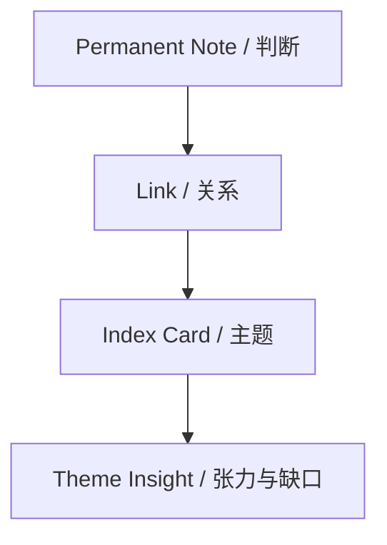

# 研思录 Phase 2 索引卡与关系模型规划

## 1. 文档目标

本文档用于规划 roadmap 中 `Phase 2：主题与张力操作系统` 的核心对象：

1. `IndexCard`
2. `Link`
3. `Theme Tension`
4. `Bridge Gap`

它不是当前 MVP 的实施承诺，也不替代现有 schema。
它的目标是为后续产品设计、数据模型演进、AI Agent 关系分析能力提供统一方向。

---

## 2. Phase 2 的产品任务

Phase 1 解决的是：

`单条笔记如何形成清晰判断`

Phase 2 解决的是：

`多个判断如何围绕一个主题形成结构、张力和写作路径`

因此，Phase 2 的重点不是继续增加笔记数量，而是让用户能看见：

1. 哪些判断互相支持
2. 哪些判断彼此冲突
3. 哪些判断构成前提与后续
4. 哪些反方或边界还没有处理
5. 哪些主题之间缺少桥接判断

---

## 3. 核心立场

索引卡不是标签。

索引卡也不是文件夹。

索引卡应该是：

`围绕一个主题组织判断、关系、张力与问题的思考对象。`

如果 `PermanentNote` 是判断原子，那么 `IndexCard` 就是主题分子。

---

## 4. 对象分层

Phase 2 建议把主题结构拆成四层：

1. `PermanentNote`：单条原创判断
2. `Link`：判断之间的有向关系
3. `IndexCard`：主题范围与阶段性理解
4. `ThemeInsight`：主题内部的张力、缺口和下一步问题



---

## 5. IndexCard 的定位升级

## 5.1 当前定位

当前 IndexCard 主要承担：

1. 容纳一组永久笔记
2. 提供排序
3. 提供说明、thesis、central_question 等字段

## 5.2 Phase 2 定位

Phase 2 中，IndexCard 应承担：

1. 主题边界
2. 主题判断
3. 主题问题
4. 主题张力
5. 写作入口

也就是说，IndexCard 不再只是“这些笔记属于同一个主题”，而是：

`我当前如何理解这个主题。`

---

## 6. IndexCard 建议字段扩展

现有字段可保留：

1. `id`
2. `index_type`
3. `title`
4. `summary`
5. `thesis`
6. `three_line_summary`
7. `central_question`
8. `items`
9. `ordering_strategy`

Phase 2 建议新增或规划以下语义字段：

| 字段 | 含义 |
|---|---|
| `theme_boundary` | 这个主题包含什么、不包含什么 |
| `current_position` | 用户目前对该主题的阶段性立场 |
| `main_tensions` | 主题内部最重要的张力或冲突 |
| `counterpoints` | 值得保留的反方或反例 |
| `open_questions` | 当前仍未解决的问题 |
| `writing_readiness` | 主题是否已经适合进入写作 |
| `missing_note_prompts` | 还缺哪些判断型笔记 |

---

## 7. IndexCard 类型重新解释

现有四类索引继续保留，但建议在 Phase 2 中重新解释它们的职责。

## 7.1 topic

定义：

围绕一个主题组织判断、问题与张力。

主要用途：

1. 长期主题积累
2. 写作入口
3. 中心问题维护

## 7.2 nearby

定义：

组织相邻但未完全合并的概念、主题或判断群。

主要用途：

1. 看见概念邻近关系
2. 防止过早合并
3. 发现桥接判断

## 7.3 sequence

定义：

表达判断之间的逻辑顺序、论证推进或写作顺序。

主要用途：

1. 论证链
2. 写作大纲
3. 课程/章节顺序

## 7.4 free_link

定义：

容纳暂时无法归类、但用户认为重要的连接。

主要用途：

1. 保留直觉性联系
2. 后续转化为明确关系
3. 作为未成熟关系池

要求：

`free_link` 必须有 rationale，否则它会退化成噪音。

---

## 8. Link 关系模型升级

## 8.1 现有关系类型

当前 schema 中已有：

1. `supports`
2. `contradicts`
3. `extends`
4. `precedes`
5. `follows`
6. `belongs_to_topic`
7. `associated_with`
8. `appears_in_draft`
9. `free_link`

## 8.2 Phase 2 建议新增语义解释

这些关系不只是数据枚举，而应该成为用户可理解的认知动作。

| 关系 | 产品含义 |
|---|---|
| `supports` | A 为 B 提供理由、证据或论证支撑 |
| `contradicts` | A 与 B 存在冲突、反例或判断不兼容 |
| `extends` | A 在 B 基础上推进、扩展或应用 |
| `precedes` | A 是理解 B 的前置判断 |
| `follows` | A 是 B 之后自然推出或需要处理的判断 |
| `belongs_to_topic` | A 被纳入某主题索引 |
| `associated_with` | A 与 B 相关，但关系尚未清晰 |
| `appears_in_draft` | A 被写作项目或脚手架引用 |
| `free_link` | 用户保留的直觉连接，必须说明理由 |

## 8.3 建议新增候选关系类型

Phase 2 可以考虑新增：

1. `qualifies`
2. `example_of`
3. `counterexample_to`
4. `bridges`
5. `reframes`

### qualifies

表示 A 限定、修正或缩小 B 的适用范围。

例子：

`AI 可以帮助思考` 被 `AI 不能替代原创判断` 限定。

### example_of

表示 A 是 B 的例子。

### counterexample_to

表示 A 是 B 的反例或边界挑战。

### bridges

表示 A 连接两个原本断裂的主题或判断群。

### reframes

表示 A 改变了看待 B 的问题框架。

---

## 9. 关系的质量标准

每条显式关系至少应回答：

1. 从哪个判断到哪个判断？
2. 关系类型是什么？
3. 为什么是这种关系？
4. 这条关系是否有来源或上下文依据？

因此，显式关系建议最小字段为：

1. `from_note_id`
2. `to_note_id`
3. `relation_type`
4. `rationale`
5. `created_by`
6. `confidence`
7. `evidence_refs`

---

## 10. 关系成熟度

Phase 2 建议引入关系成熟度概念。

| 成熟度 | 含义 |
|---|---|
| `implicit` | 从正文 `[[wikilink]]` 自动解析得到 |
| `suggested` | AI 或系统建议，但用户未确认 |
| `draft` | 用户采纳或手动创建，但理由还不充分 |
| `confirmed` | 用户确认关系类型与理由 |

关系成熟度的意义：

1. 区分普通提及和真实结构
2. 避免图谱把所有连接都当作同等强度
3. 为 AI 候选关系提供安全边界

---

## 11. ThemeInsight：主题洞察对象

Phase 2 可以新增一个轻量概念：

`ThemeInsight`

它不一定一开始就是独立表，也可以先作为 IndexCard 的派生视图。

它用于承载：

1. 主题内部张力
2. 反方与边界
3. 桥接缺口
4. 写作就绪度
5. 下一步阅读或写作问题

## 11.1 ThemeInsight 建议结构

```ts
interface ThemeInsight {
  index_id: string;
  tensions: ThemeTension[];
  bridge_gaps: BridgeGap[];
  counterpoints: string[];
  missing_note_prompts: string[];
  writing_readiness: "not_ready" | "nearly_ready" | "ready";
  next_questions: string[];
}
```

---

## 12. ThemeTension：主题张力

主题张力不是普通冲突。

它指的是：

`一个主题内部推动思考继续前进的未解决关系。`

## 12.1 张力来源

张力可能来自：

1. 两条永久笔记互相冲突
2. 一个判断缺少边界
3. 一个主题同时指向两种写作方向
4. 一个概念被多种方式使用
5. 反方没有被处理

## 12.2 ThemeTension 建议结构

```ts
interface ThemeTension {
  id: string;
  index_id: string;
  title: string;
  note_ids: string[];
  description: string;
  tension_type: "conflict" | "boundary" | "ambiguity" | "missing_evidence" | "competing_frame";
  status: "open" | "addressed" | "parked";
}
```

## 12.3 产品展示

主题页应显示：

1. 当前最重要的张力
2. 涉及哪些永久笔记
3. 是否已经有处理方式
4. 是否应进入写作脚手架

---

## 13. BridgeGap：桥接缺口

桥接缺口指：

`两个判断群之间看起来相关，但缺少一条过渡性判断或解释性连接。`

## 13.1 BridgeGap 建议结构

```ts
interface BridgeGap {
  id: string;
  index_id?: string;
  from_cluster_note_ids: string[];
  to_cluster_note_ids: string[];
  missing_claim_prompt: string;
  reason: string;
  status: "open" | "filled" | "dismissed";
}
```

## 13.2 产品价值

BridgeGap 能帮助用户发现：

1. 哪里需要补一条永久笔记
2. 哪里写作会断
3. 哪两个主题之间需要重新框定

---

## 14. 主题工作区建议布局

主题工作区建议采用三栏：

```text
┌──────────────────┬─────────────────────────────┬──────────────────────┐
│ 主题列表          │ 主题判断与关系                │ 张力 / 缺口 / 写作入口 │
└──────────────────┴─────────────────────────────┴──────────────────────┘
```

## 14.1 左栏：主题列表

显示：

1. 主题标题
2. 永久笔记数量
3. 中心问题状态
4. 张力数量
5. 写作就绪度

## 14.2 中栏：主题内容

显示：

1. 主题说明
2. 主题一句话
3. 主题三句话
4. 相关永久笔记
5. 关系链

## 14.3 右栏：主题洞察

显示：

1. 中心问题
2. 主要张力
3. 桥接缺口
4. 反方与边界
5. 下一步动作

---

## 15. 图谱中的关系可视化

Phase 2 的图谱不应只显示是否连接。

建议使用关系语义驱动图谱：

1. `supports`：支撑链
2. `contradicts`：冲突线
3. `precedes/follows`：顺序链
4. `bridges`：桥接线
5. `associated_with`：弱连接

图谱应允许过滤：

1. 只看冲突
2. 只看支撑链
3. 只看未解释关系
4. 只看桥接缺口

---

## 16. AI 在 Phase 2 的角色

AI 可以做：

1. 建议关系类型
2. 识别主题张力
3. 提示桥接缺口
4. 建议中心问题
5. 提醒反方或边界
6. 为写作脚手架标出开放问题

AI 不可以做：

1. 自动确认关系
2. 自动把主题结论落为用户立场
3. 自动抹平冲突
4. 自动把桥接缺口补成永久笔记正文

所有 AI 关系建议都必须是 `suggested` 状态，并展示：

1. 依据的笔记
2. 建议的关系类型
3. 关系理由
4. 用户可确认、改写或拒绝

---

## 17. 与写作工作台的关系

Phase 2 的主题模型最终应服务写作。

写作项目从主题进入时，应继承：

1. 主题中心问题
2. 主题下的关键永久笔记
3. 支撑链
4. 冲突点
5. 反方与边界
6. 桥接缺口

生成脚手架时，应显式保留：

1. 已有判断
2. 需要论证的关系
3. 尚未处理的张力
4. 需要补充的过渡性判断

---

## 18. 最小可实施切片建议

如果未来进入实现，Phase 2 建议按以下顺序切：

1. 关系类型说明与 UI 显示
2. Link 增加 `rationale` 强提示
3. 区分 `implicit / suggested / confirmed` 关系成熟度
4. 主题页显示 `central_question` 与相关永久笔记
5. 主题页显示冲突关系与桥接缺口
6. 从主题直接进入写作项目
7. AI 候选关系建议
8. ThemeInsight 派生视图

---

## 19. 成功信号

Phase 2 做对后，应出现这些信号：

1. 用户不再只问“这些笔记怎么分类”，而开始问“这些判断之间是什么关系”
2. 主题索引不再只是收藏夹，而开始像一个研究问题
3. 图谱不再只是漂亮网络，而能指出冲突和缺口
4. 写作项目自然继承主题中的张力和反方
5. AI 建议更多用于发现结构，而不是生成结论

---

## 20. 核心判断

Phase 2 的本质，是让研思录从“帮助用户形成判断”继续走向“帮助用户组织判断之间的关系”。

没有这一层，产品会停在卡片和提纲之间。

有了这一层，研思录才会真正接近“知识创作界 Codex”的中间形态。
