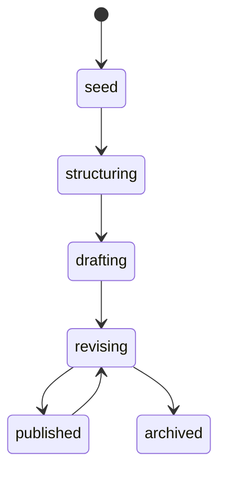

# 研思录 Phase 4 知识作品工作流规划

## 1. 文档目标

本文档用于规划 roadmap 中 `Phase 4：知识创作工作台`。

它回答的问题是：

1. 当用户已经形成原创判断、主题结构和关系张力后，如何继续推进为知识作品？
2. 写作项目如何从一次性脚手架，升级为长期创作对象？
3. 作品如何保持来源可追溯、判断可修正、结构可演化？
4. AI 如何参与作品构建，但不替用户成为作者？

---

## 2. Phase 4 的核心定位

Phase 4 的目标不是生成文章。

Phase 4 的目标是：

`帮助用户把已有判断、主题、关系和张力，持续组织成可发布、可迭代、可追溯的知识作品。`

知识作品包括但不限于：

1. 长文
2. 系列文章
3. 课程草案
4. 研究专题
5. 书稿章节
6. 演讲或播客大纲

---

## 3. 核心命题

知识创作不是一次生成。

知识创作是围绕：

1. 判断
2. 主题
3. 结构
4. 证据
5. 反方
6. 修改
7. 版本

持续生长的过程。

因此，Phase 4 要解决的不是“如何更快写完”，而是：

`如何让用户已有的思想结构稳定生长为作品。`

---

## 4. 从 WritingProject 到 KnowledgeWork

当前 `WritingProject` 可以表达一次写作项目。

Phase 4 建议引入更高一层概念：

`KnowledgeWork`

它表示一个长期知识作品对象。

## 4.1 两者区别

| 对象 | 含义 |
|---|---|
| `WritingProject` | 一次具体写作任务或一篇作品草稿 |
| `KnowledgeWork` | 一个可长期迭代的知识作品或作品系列 |

例子：

1. WritingProject：写一篇《AI 不应替代原创判断》
2. KnowledgeWork：一个关于“AI 与原创思考”的长期专题

## 4.2 KnowledgeWork 支持的作品类型

建议支持：

1. `essay`
2. `article_series`
3. `course`
4. `research_dossier`
5. `book_chapter`
6. `talk`
7. `other`

---

## 5. KnowledgeWork 建议字段

```ts
interface KnowledgeWork {
  id: string;
  work_type: "essay" | "article_series" | "course" | "research_dossier" | "book_chapter" | "talk" | "other";
  title: string;
  central_question?: string;
  core_thesis?: string;
  audience?: string;
  intended_effect?: string;
  source_index_ids: string[];
  source_note_ids: string[];
  writing_project_ids: string[];
  status: "seed" | "structuring" | "drafting" | "revising" | "published" | "archived";
  created_at: string;
  updated_at: string;
}
```

## 5.1 字段解释

| 字段 | 含义 |
|---|---|
| `central_question` | 作品围绕的中心问题 |
| `core_thesis` | 作品要推进的核心判断 |
| `audience` | 面向谁 |
| `intended_effect` | 希望读者读完后发生什么变化 |
| `source_index_ids` | 作品依赖的主题索引 |
| `source_note_ids` | 作品依赖的关键永久笔记 |
| `writing_project_ids` | 作品下的具体写作项目 |

---

## 6. 作品生命周期

建议生命周期：



## 6.1 seed

作品种子。

来源可能是：

1. 一条永久笔记
2. 一个主题索引
3. 一个中心问题
4. 一个写作项目

## 6.2 structuring

结构期。

用户组织：

1. 主题
2. 判断
3. 支撑链
4. 反方
5. 缺口

## 6.3 drafting

草稿期。

用户开始写作正文。

AI 可辅助：

1. 结构检查
2. 证据映射
3. 缺口提醒
4. 反方提醒

但不能默认替用户生成完整终稿。

## 6.4 revising

修订期。

用户处理：

1. 判断是否清楚
2. 证据是否充分
3. 反方是否被处理
4. 结构是否顺畅
5. 读者是否能跟上

## 6.5 published

已发布。

系统仍应保留：

1. 来源追溯
2. 版本历史
3. 后续修订入口
4. 新材料回流入口

---

## 7. 作品工作台页面结构

建议采用五区：

1. `作品概览`
2. `思想素材`
3. `结构地图`
4. `草稿与版本`
5. `发布与回流`

## 7.1 作品概览

显示：

1. 标题
2. 类型
3. 中心问题
4. 核心判断
5. 受众
6. 期望影响
7. 当前状态

核心问题：

`这个作品到底要推进什么判断？`

## 7.2 思想素材

显示：

1. 关联主题
2. 关键永久笔记
3. 支撑关系
4. 冲突关系
5. 边界与反方

核心问题：

`这个作品依赖哪些已经形成的判断？`

## 7.3 结构地图

显示：

1. 章节或段落结构
2. 每节用途
3. 每节证据笔记
4. 每节开放问题
5. 每节反方或缺口

核心问题：

`这些判断如何组成一个可阅读的作品？`

## 7.4 草稿与版本

显示：

1. 当前草稿
2. 历史版本
3. 修改说明
4. 判断变化
5. 来源变化

核心问题：

`这篇作品如何随着理解变化而演化？`

## 7.5 发布与回流

显示：

1. 导出 Markdown
2. 导出结构化提纲
3. 标记发布状态
4. 发布后新增反馈或材料
5. 将新材料回流到主题或笔记

核心问题：

`作品发布后如何继续滋养知识系统？`

---

## 8. 写作项目与作品的关系

一个 `KnowledgeWork` 可以包含多个 `WritingProject`。

例子：

1. KnowledgeWork：AI 与原创思考专题
2. WritingProject A：为什么 AI 不应代写永久笔记
3. WritingProject B：知识工具如何帮助用户形成判断
4. WritingProject C：AI Agent 在知识创作中的边界

这能让研思录支持系列化创作，而不只是单篇文章。

---

## 9. DraftScaffold 的升级方向

当前脚手架可以继续保留。

Phase 4 中建议升级为：

`TraceableStructure`

它强调：

1. 每一节为什么存在
2. 每一节依赖哪些永久笔记
3. 每一节处理哪个问题
4. 每一节是否存在反方或缺口

## 9.1 建议结构

```ts
interface TraceableSection {
  id: string;
  heading: string;
  purpose: string;
  central_claim?: string;
  evidence_note_ids: string[];
  source_index_ids: string[];
  tensions_handled: string[];
  bridge_gaps_handled: string[];
  counterpoints: string[];
  open_questions: string[];
  draft_note_id?: string;
  order: number;
}
```

---

## 10. 草稿笔记

Phase 4 不建议让 AI 直接生成最终文章。

更合适的方式是引入：

`DraftNote`

它是用户维护的正文草稿，和结构、证据、版本绑定。

## 10.1 DraftNote 建议字段

```ts
interface DraftNote {
  id: string;
  knowledge_work_id: string;
  writing_project_id?: string;
  title: string;
  markdown_body: string;
  linked_section_ids: string[];
  source_note_ids: string[];
  status: "draft" | "revision" | "ready" | "published";
  created_at: string;
  updated_at: string;
}
```

## 10.2 产品规则

1. DraftNote 可以由用户从脚手架创建
2. DraftNote 正文归用户所有
3. AI 可以建议修改、指出缺口、生成替代表达候选
4. AI 不应自动替换正文

---

## 11. 作品质量检查

Phase 4 可以引入作品级检查。

检查项建议：

1. 核心判断是否清楚
2. 中心问题是否贯穿全文
3. 章节是否都有用途
4. 证据映射是否完整
5. 反方是否被处理
6. 边界是否说明
7. 是否存在断裂或跳跃
8. 是否有未解决但被掩盖的问题

## 11.1 AI 可参与的检查

AI 可以输出：

1. 结构风险
2. 证据缺口
3. 反方遗漏
4. 读者理解难点
5. 可能的重排建议

所有建议仍为候选。

---

## 12. 判断演化记录

Phase 4 的一个重要能力是：

`让用户看到自己的判断如何变化。`

建议记录：

1. thesis 变化
2. central_question 变化
3. relation 变化
4. draft section 变化
5. published version 变化

这能让研思录不只是写作工具，而是思维成长记录。

---

## 13. AI 在 Phase 4 的角色

AI 可以做：

1. 结构检查
2. 证据映射检查
3. 反方提醒
4. 缺口提示
5. 章节重排建议
6. 草稿表达候选
7. 版本变化摘要

AI 不可以做：

1. 默认生成完整终稿
2. 自动替换用户正文
3. 自动发布
4. 自动删除反方或缺口
5. 把 AI 语言包装成用户原创判断

---

## 14. 作品类型的差异化

不同知识作品需要不同结构。

## 14.1 essay

重点：

1. 核心论点
2. 支撑链
3. 反方
4. 结论

## 14.2 article_series

重点：

1. 系列总问题
2. 每篇文章的位置
3. 篇与篇之间的推进关系
4. 读者路径

## 14.3 course

重点：

1. 学习目标
2. 模块顺序
3. 概念前置关系
4. 练习与迁移

## 14.4 research_dossier

重点：

1. 研究问题
2. 来源与证据
3. 分歧与争议
4. 未解问题

## 14.5 book_chapter

重点：

1. 章节主题
2. 与前后章关系
3. 核心论证
4. 素材密度

## 14.6 talk

重点：

1. 听众
2. 情绪节奏
3. 关键判断
4. 可讲述案例

---

## 15. 与 Phase 5 的关系

Phase 4 是“知识创作工作台”。

Phase 5 才是“知识创作界 Codex”成熟形态。

Phase 4 应先打磨：

1. 单个作品如何从判断生长
2. 系列作品如何组织
3. 草稿如何绑定证据和结构
4. 作品如何回流知识系统

Phase 5 再考虑：

1. 多 Agent 协同
2. 跨项目研究辅助
3. 作品级资产管理
4. 更成熟的创作路径推荐

---

## 16. 最小可实施切片建议

如果未来进入实现，Phase 4 建议按以下顺序切：

1. WritingProject 增强为作品准备对象
2. 支持从 IndexCard 创建 WritingProject
3. 脚手架绑定主题、张力、桥接缺口
4. 从脚手架创建 DraftNote
5. DraftNote 绑定 section 与 evidence_note_ids
6. 引入 KnowledgeWork 概念
7. 支持系列作品
8. 支持作品级版本与回流

---

## 17. 成功信号

Phase 4 做对后，应出现这些信号：

1. 用户不再只是生成提纲，而是持续维护作品
2. 每个作品都能追溯到原创判断和主题结构
3. 用户能看见哪些章节还缺证据、反方或桥接判断
4. 用户能从一个作品回流出新的永久笔记或主题问题
5. AI 被用来检查和启发，而不是替用户写完

---

## 18. 核心判断

Phase 4 的本质，是让研思录从“帮助用户形成和组织判断”继续走向“帮助用户把判断长期生长为作品”。

如果 Phase 4 做对，研思录就不再只是笔记与写作之间的桥，而会成为真正的知识创作工作台。
