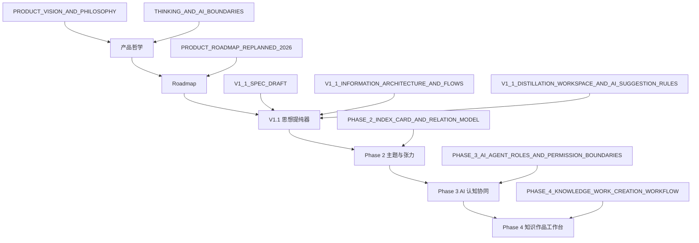

# 研思录产品规划文档索引

## 1. 文档目的

本文档是研思录产品规划体系的入口页。

它用于回答：

1. 当前有哪些产品规划文档？
2. 每份文档解决什么问题？
3. 新成员或后续讨论应该按什么顺序阅读？
4. 当前真正优先推进的方向是什么？

---

## 2. 当前产品规划主线

研思录当前已经形成一条清晰主线：

`可信本地工作流 -> 思想提纯器 -> 主题与张力操作系统 -> AI 认知协同层 -> 知识创作工作台 -> 知识创作界 Codex`

这条主线背后的长期判断是：

1. 知识不是仓库。
2. 产品目标不是让用户记更多，而是帮助用户长出更清明的判断力。
3. 原创判断必须归用户。
4. AI 可以帮助理解、分析、提问和组织，但不能替用户拥有思想。
5. 研思录的长期愿景是成为写作与知识创作领域的 Codex。

---

## 3. 推荐阅读顺序

## 3.1 第一层：产品哲学与边界

先读：

1. [PRODUCT_VISION_AND_PHILOSOPHY_V0_1.md](/E:/Projects/Thinking%20in%20Notes/yansilu/docs/PRODUCT_VISION_AND_PHILOSOPHY_V0_1.md)
2. [THINKING_AND_AI_BOUNDARIES.md](/E:/Projects/Thinking%20in%20Notes/yansilu/docs/THINKING_AND_AI_BOUNDARIES.md)

解决的问题：

1. 研思录为什么不是知识仓库？
2. 为什么原创判断必须归用户？
3. AI 在产品中到底能做什么、不能做什么？
4. 什么能力会让产品跑偏？

---

## 3.2 第二层：长期路线图

再读：

1. [PRODUCT_ROADMAP_REPLANNED_2026.md](/E:/Projects/Thinking%20in%20Notes/yansilu/docs/PRODUCT_ROADMAP_REPLANNED_2026.md)

解决的问题：

1. 未来路线为什么按 Phase 0 到 Phase 5 推进？
2. 当前产品处于哪个阶段？
3. 为什么下一步应该先做思想提纯，而不是重型 AI 或大连接器？

---

## 3.3 第三层：V1.1 思想提纯器

然后读：

1. [V1_1_SPEC_DRAFT.md](/E:/Projects/Thinking%20in%20Notes/yansilu/docs/V1_1_SPEC_DRAFT.md)
2. [V1_1_INFORMATION_ARCHITECTURE_AND_FLOWS.md](/E:/Projects/Thinking%20in%20Notes/yansilu/docs/V1_1_INFORMATION_ARCHITECTURE_AND_FLOWS.md)
3. [V1_1_DISTILLATION_WORKSPACE_AND_AI_SUGGESTION_RULES.md](/E:/Projects/Thinking%20in%20Notes/yansilu/docs/V1_1_DISTILLATION_WORKSPACE_AND_AI_SUGGESTION_RULES.md)

解决的问题：

1. V1.1 为什么是“思想提纯器”？
2. `thesis`、`three_line_summary`、`central_question`、`intent` 如何进入主流程？
3. 提纯工作区应该如何组织？
4. AI 候选如何出现但不越权？

---

## 3.4 第四层：Phase 2 主题与张力

继续读：

1. [PHASE_2_INDEX_CARD_AND_RELATION_MODEL.md](/E:/Projects/Thinking%20in%20Notes/yansilu/docs/PHASE_2_INDEX_CARD_AND_RELATION_MODEL.md)

解决的问题：

1. 索引卡为什么不是标签或文件夹？
2. 关系如何从普通链接升级为认知结构？
3. 主题张力、反方、桥接缺口如何成为产品对象？
4. 图谱如何真正服务思考？

---

## 3.5 第五层：Phase 3 AI 认知协同层

继续读：

1. [PHASE_3_AI_AGENT_ROLES_AND_PERMISSION_BOUNDARIES.md](/E:/Projects/Thinking%20in%20Notes/yansilu/docs/PHASE_3_AI_AGENT_ROLES_AND_PERMISSION_BOUNDARIES.md)

解决的问题：

1. 未来接入 AI Agent SDK 时，Agent 应该如何分工？
2. 哪些 Agent 可以存在？
3. AI 能读什么、建议什么、写什么？
4. 哪些能力永远不能自动化？

---

## 3.6 第六层：Phase 4 知识作品工作台

最后读：

1. [PHASE_4_KNOWLEDGE_WORK_CREATION_WORKFLOW.md](/E:/Projects/Thinking%20in%20Notes/yansilu/docs/PHASE_4_KNOWLEDGE_WORK_CREATION_WORKFLOW.md)

解决的问题：

1. 研思录如何从脚手架走向长期知识作品？
2. `KnowledgeWork` 和 `WritingProject` 有什么区别？
3. 长文、系列、课程、研究专题如何被组织？
4. 作品如何保持追溯、修订和回流？

---

## 4. 当前优先级判断

当前不建议直接进入 Phase 3 或 Phase 4 的实施。

更合理的推进顺序是：

1. 收口 Phase 0 的可信 MVP
2. 推进 Phase 1 / V1.1 的思想提纯主链路
3. 再推进 Phase 2 的主题与关系模型
4. 之后谨慎接入 Phase 3 的 AI Agent

当前最应该优先规划和验证的是：

1. 原创笔记的 `thesis` 与 `three_line_summary`
2. 提纯工作区
3. 索引卡的 `central_question`
4. 写作项目的 `intent`
5. AI 候选态 UI 与保存确认规则

---

## 5. 已形成的关键产品决策

## 5.1 原创判断归用户

AI 可以建议，但不能直接拥有用户的判断。

这意味着：

1. AI 不得自动生成并保存原创笔记正文。
2. AI 候选必须经过用户确认。
3. 用户确认应被视为一个明确的主体性动作。

## 5.2 产品奖励提炼，不奖励收集

首页、搜索和指标应优先强调：

1. 原创判断形成
2. 主题压缩
3. 中心问题
4. 写作准备

而不是：

1. 导入量
2. 高亮量
3. 资料数量
4. AI 生成次数

## 5.3 写作从判断生长

写作入口应优先来自：

1. 原创笔记
2. 索引卡
3. 写作篮
4. 主题中心问题

不应默认来自空白 prompt。

## 5.4 图谱服务于张力和缺口

图谱的价值不在于展示很多节点，而在于帮助用户看见：

1. 支撑链
2. 冲突
3. 桥接缺口
4. 未解释关系

---

## 6. 不应优先推进的方向

以下方向目前不应成为近期核心：

1. AI 一键生成完整文章
2. AI 批量生成永久笔记
3. 默认全库 AI 分析
4. 团队协作平台化
5. 大而全插件市场
6. 默认全局图谱
7. 以导入量或收藏量作为主增长叙事

---

## 7. 当前规划文档关系图

---

## 8. 下一步建议

下一轮最适合继续做三件事之一：

1. 把 V1.1 拆成可执行的产品需求清单
2. 为提纯工作区画文字版线框稿
3. 把数据模型和 API contract 对齐到 V1.1 的提纯字段与候选态状态机

如果目标是尽快进入未来实施，建议优先做：

`V1.1 可执行需求清单`

因为目前方向已经足够清楚，下一步需要把“规划语言”压缩为“可进入研发评估的需求语言”。
