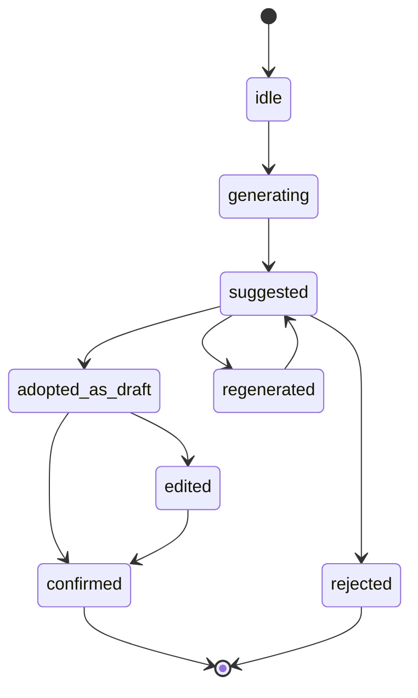

# 研思录 V1.1 提纯工作区与 AI 候选态交互规则

## 1. 文档目标

本文档继续细化 V1.1 的核心模块：

`提纯工作区`

以及贯穿该模块的：

`AI 候选态交互规则`

这份文档不定义具体视觉风格，也不要求立即实施。
它用于回答一个关键问题：

`当用户从笔记走向判断、主题和写作准备时，产品应该如何帮助，而不替代用户思考？`

---

## 2. 模块定位

提纯工作区不是 AI 工作台，也不是批量生成页面。

它的定位是：

`帮助用户把中间状态的笔记、主题和写作项目，推进到更清晰的判断状态。`

它处理的不是“更多内容”，而是“更清楚的内容”。

---

## 3. 核心原则

### 3.1 手写优先

所有关键字段都应允许用户直接填写。

AI 只能提供候选，不能成为唯一入口。

### 3.2 候选不是判断

AI 生成的任何内容，在用户确认前都只是候选。

候选内容不能静默进入：

1. 原创笔记正文
2. 主题结论
3. 写作项目最终意图
4. 脚手架中的最终表达

### 3.3 确认不是无脑接受

用户确认一个 AI 候选时，产品应让用户感知到：

`这是我愿意承担的判断。`

因此，交互上应鼓励：

1. 采纳为草稿
2. 用户改写
3. 再确认

而不是只给一个简单的“接受”。

---

## 4. 提纯工作区入口

V1.1 中，提纯不应只存在于一个独立页面。

建议提供 4 个入口：

1. `工作台推荐动作`
2. `原创笔记右侧提纯面板`
3. `主题工作区的主题压缩区`
4. `写作工作区的意图澄清区`

### 4.1 工作台入口

工作台展示队列：

1. 待一句话论点
2. 待三句话压缩
3. 待中心问题
4. 待写作意图

用户点击后进入提纯工作区，并自动定位到对应对象。

### 4.2 笔记入口

在原创笔记编辑器右侧增加 `提纯` 标签页。

适合用户在编辑单条笔记时顺手完成：

1. 一句话论点
2. 三句话压缩
3. 边界或反方

### 4.3 主题入口

在主题工作区中，索引卡应提供：

1. 主题一句话
2. 主题三句话
3. 当前中心问题
4. 当前张力

### 4.4 写作入口

在写作项目生成脚手架前，提供写作意图澄清：

1. 我想说明什么？
2. 我想说服谁？
3. 我希望读者接受什么判断？
4. 当前最大缺口是什么？

---

## 5. 提纯工作区页面结构

建议采用三栏结构：

```text
┌──────────────────┬─────────────────────────────┬──────────────────────┐
│ 提纯队列          │ 当前对象内容                  │ 提纯与候选建议         │
│                  │                             │                      │
│ 待一句话          │ 标题 / 正文 / 来源 / 关系       │ thesis               │
│ 待三句话          │                             │ three_line_summary   │
│ 待中心问题        │                             │ AI candidate         │
│ 待写作意图        │                             │ quality checks       │
└──────────────────┴─────────────────────────────┴──────────────────────┘
```

### 5.1 左栏：提纯队列

队列分组建议：

1. `原创笔记待一句话`
2. `原创笔记待三句话`
3. `主题待中心问题`
4. `写作项目待意图澄清`

每个队列项显示：

1. 标题
2. 对象类型
3. 当前缺失项
4. 最近更新时间
5. 来源或所属主题

### 5.2 中栏：当前对象内容

如果对象是原创笔记，显示：

1. 标题
2. 正文
3. 来源引用
4. 相关笔记
5. 已有标签

如果对象是主题索引，显示：

1. 主题标题
2. 主题说明
3. 相关原创笔记列表
4. 关系摘要
5. 已有中心问题或空状态

如果对象是写作项目，显示：

1. 项目标题
2. 写作篮
3. 相关主题
4. 已有脚手架或空状态

### 5.3 右栏：提纯与候选建议

右栏是主要操作区。

它应包含：

1. 用户可编辑字段
2. AI 候选卡片
3. 质量检查
4. 完成动作

---

## 6. 原创笔记提纯交互

## 6.1 字段结构

原创笔记提纯区建议包含：

1. `一句话论点`
2. `三句话压缩`
3. `边界 / 反方 / 不适用条件`
4. `未解问题`

其中 V1.1 最小必做是：

1. `一句话论点`
2. `三句话压缩`

边界与未解问题可以作为渐进补全项。

---

## 6.2 一句话论点

### 目的

让用户回答：

`这条原创笔记到底主张什么？`

### 质量标准

一句话论点应满足：

1. 是判断，不只是主题名
2. 可独立理解
3. 不过长
4. 不空泛
5. 与正文一致

### 不合格例子

1. `关于知识管理`
2. `AI 很重要`
3. `这篇文章讲了很多`

### 合格方向

1. `知识工具的价值不在于存储更多，而在于帮助用户形成可承担的判断。`
2. `AI 在研思录中应作为思维陪练，而不是原创笔记的代写者。`

---

## 6.3 三句话压缩

### 目的

让用户回答：

1. 这条观点是什么？
2. 为什么它成立或重要？
3. 它和哪个问题、主题或写作目标相关？

### 建议结构

```text
1. 这条观点在说什么
2. 为什么它成立或重要
3. 它服务于哪个问题或写作方向
```

### 质量标准

三句话压缩应满足：

1. 恰好三句
2. 每句承担不同功能
3. 不重复正文大段表达
4. 能帮助未来写作调用

---

## 7. 主题提纯交互

主题提纯面向 `IndexCard`。

它的目的不是给主题起一个好看的标题，而是帮助用户回答：

`这个主题正在围绕什么判断或问题形成？`

## 7.1 字段结构

主题提纯区建议包含：

1. `主题一句话`
2. `主题三句话`
3. `当前中心问题`
4. `主题张力`
5. `待补判断`

## 7.2 中心问题质量标准

中心问题应满足：

1. 指向真实张力
2. 能推动后续阅读或写作
3. 不是泛泛的百科问题
4. 能连接主题下多条原创笔记

### 不合格例子

1. `什么是知识管理？`
2. `AI 有什么用？`
3. `如何写作？`

### 合格方向

1. `一个知识工具如何在使用 AI 的同时，仍然保护用户的原创判断？`
2. `笔记系统如何从存储材料，转向训练用户形成判断？`

---

## 8. 写作意图澄清交互

写作意图澄清面向 `WritingProject`。

它的目的不是生成文章，而是让用户在生成脚手架前先明确：

`这次写作要让什么判断变得可表达？`

## 8.1 字段结构

写作意图区建议包含：

1. `我想说明什么？`
2. `我想说服谁？`
3. `我希望读者读完后接受什么判断？`
4. `这篇作品当前最大的缺口是什么？`

## 8.2 脚手架前检查

生成脚手架前，系统应检查：

1. 是否有原创笔记
2. 是否有明确写作意图
3. 是否存在中心问题
4. 是否存在明显未处理冲突
5. 是否缺少证据或桥接判断

检查不一定阻断，但应明确提示。

---

## 9. AI 候选态状态机

## 9.1 状态定义

建议所有 AI 候选都使用同一套状态：



## 9.2 状态说明

| 状态 | 含义 |
|---|---|
| `idle` | 尚未请求 AI 候选 |
| `generating` | 正在生成候选 |
| `suggested` | 候选已返回，但未进入用户字段 |
| `adopted_as_draft` | 用户把候选放入可编辑草稿 |
| `edited` | 用户已改写候选 |
| `confirmed` | 用户确认该字段代表自己的判断 |
| `rejected` | 用户拒绝该候选 |
| `regenerated` | 用户请求换一版 |

---

## 10. AI 候选卡片规范

每张 AI 候选卡片必须包含：

1. 候选内容
2. 生成依据
3. 作用范围
4. 操作按钮

### 10.1 生成依据

候选卡片必须说明它基于什么生成：

1. 当前原创笔记正文
2. 当前主题下的若干原创笔记
3. 当前写作项目的写作篮
4. 当前来源或引用

### 10.2 操作按钮

建议按钮：

1. `采纳为草稿`
2. `我来改写`
3. `换一版`
4. `拒绝`

不建议直接使用：

1. `接受`
2. `完成`
3. `自动保存`

原因：

这些词容易把候选内容包装成已经完成的判断。

---

## 11. 保存与确认规则

## 11.1 用户手写内容

用户手写内容可以直接保存为草稿。

当用户明确点击确认时，字段进入 `confirmed`。

## 11.2 AI 候选内容

AI 候选内容必须经过以下任一动作后才能确认：

1. 用户采纳为草稿后确认
2. 用户采纳为草稿并改写后确认

AI 候选不得直接从 `suggested` 静默进入 `confirmed`。

## 11.3 确认文案建议

确认按钮文案建议：

1. `确认这是我的判断`
2. `确认这个主题问题`
3. `确认这个写作意图`

这类文案比 `保存` 更能体现主体性。

---

## 12. 质量检查规则

V1.1 可以先做轻量规则检查，不急着上复杂评分。

## 12.1 一句话论点检查

检查项：

1. 是否为空
2. 是否过短
3. 是否过长
4. 是否像标题而不是判断
5. 是否含有过度泛化词

## 12.2 三句话压缩检查

检查项：

1. 是否恰好三项
2. 是否每项非空
3. 是否明显重复
4. 是否缺少理由或相关性

## 12.3 中心问题检查

检查项：

1. 是否是问题句
2. 是否指向张力
3. 是否过于百科化
4. 是否能连接当前主题笔记

## 12.4 写作意图检查

检查项：

1. 是否说明写作目标
2. 是否说明受众
3. 是否说明希望读者接受的判断
4. 是否缺少证据或主题支撑

---

## 13. 最小可实施切片建议

如果未来开始实现，建议按以下顺序切：

1. 原创笔记右侧 `提纯` 面板
2. `thesis` 与 `three_line_summary` 手写保存
3. 提纯队列
4. IndexCard 的 `central_question`
5. WritingProject 的 `intent`
6. AI 候选卡片 UI
7. AI 候选态状态机
8. 质量检查

这个顺序的好处是：

1. 先验证用户是否愿意手动提纯
2. 再引入 AI 辅助
3. 不让 AI 过早决定产品主路径

---

## 14. 成功信号

V1.1 的提纯工作区做对后，应出现这些信号：

1. 用户打开原创笔记后，愿意补一句话论点
2. 用户开始把主题问题当作索引卡的核心
3. 写作项目开始先问“我要表达什么”，再生成脚手架
4. AI 候选被用来启发改写，而不是直接替用户完成判断
5. 首页的进展感开始从“资料量”转向“判断成熟度”

---

## 15. 核心判断

提纯工作区是 V1.1 最重要的产品验证点。

如果用户愿意在这里停留，说明研思录的“思想提纯器”方向成立。

如果用户只想跳过这里直接生成内容，说明产品还没有成功建立自己的核心使用心智。
