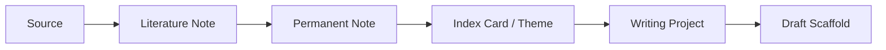
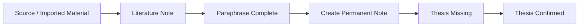
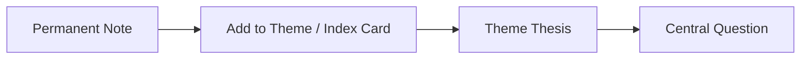
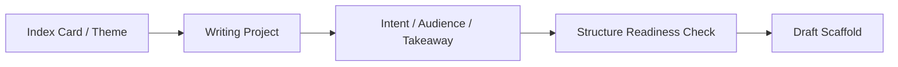

# 研思录 V1.1 信息架构与页面流程草案

## 1. 文档目标

本文档用于把 `V1.1` 从方向性 spec 继续下沉为：

1. 信息架构
2. 页面分层
3. 关键对象流转
4. 提纯动作的交互位置
5. AI 候选态的嵌入方式

它不是视觉稿，也不是前端实现说明。
它的目标是保证后续设计、产品和研发讨论时，对“V1.1 到底长什么样”有同一张底图。

---

## 2. V1.1 的产品任务

V1.1 的核心不是增加更多入口，而是让用户更稳定地完成：

`来源 -> 转述 -> 判断 -> 主题 -> 写作准备`

因此，V1.1 的信息架构不应该再以“文件树 + 编辑器 + 一堆工作台”来组织，而应开始以：

1. `我正在处理什么认知对象`
2. `我当前处在什么思考阶段`
3. `下一步最值得完成什么提纯动作`

来组织。

---

## 3. V1.1 的设计原则

### 3.1 优先展示思考进度，而不是收集进度

首页和主工作区优先展示：

1. 多少条原创判断已形成
2. 多少条书摘还待转述
3. 多少条原创笔记还待压缩
4. 多少个主题还缺中心问题

### 3.2 让提纯动作自然出现，而不是变成重表单

用户不应被一次性要求补完所有字段。

V1.1 更适合做成：

1. 先允许保存
2. 再通过队列、状态和推荐动作推动补全

### 3.3 把对象边界做清楚

V1.1 必须让用户感知到以下对象是不同层次：

1. `Source`
2. `LiteratureNote`
3. `PermanentNote`
4. `IndexCard`
5. `WritingProject`

### 3.4 AI 不做主入口，只做局部候选层

V1.1 不应出现一个“万能 AI 聊天框”作为主入口。

AI 更适合嵌在：

1. 原创笔记提纯
2. 主题索引压缩
3. 写作前澄清

这些具体上下文里。

---

## 4. V1.1 信息架构总览

## 4.1 顶层导航建议

建议 V1.1 的顶层工作区调整为：

1. `工作台`
2. `笔记`
3. `提纯`
4. `主题`
5. `图谱`
6. `写作`
7. `导入`
8. `设置`

相比当前 MVP，这里最大的变化是：

1. 新增 `提纯`
2. 强化 `主题`
3. 弱化“只是编辑”

这会把产品叙事从“管理笔记”转成“推进思考”。

---

## 4.2 顶层对象关系

V1.1 要让用户清楚知道：

1. `Source` 是来源对象
2. `LiteratureNote` 是转述与定位层
3. `PermanentNote` 是判断层
4. `IndexCard` 是主题组织层
5. `WritingProject` 是表达准备层

---

## 4.3 顶层状态视角

V1.1 建议引入一个轻量的“思考状态”视角：

1. `待转述`
2. `待形成判断`
3. `待压缩`
4. `待入主题`
5. `待写作澄清`
6. `可进入脚手架`

这组状态不一定都要变成数据库主状态，但至少应变成可见的工作流分层。

---

## 5. 页面架构

## 5.1 工作台

### 页面目的

帮助用户知道：

1. 我当前最值得推进什么
2. 哪些对象卡在中间状态
3. 哪些主题已经接近可写

### 页面结构

1. 顶部：本周思考进展
2. 中部：四块工作区卡片
3. 底部：推荐下一步

### 顶部主指标建议

1. 新增原创判断数
2. 待提纯原创笔记数
3. 已形成中心问题的主题数
4. 已可进入写作的项目数

### 中部四块建议

1. `待转述`
2. `待压缩`
3. `待组织主题`
4. `待写作澄清`

### 主按钮建议

不要写：

1. `AI 帮我写`
2. `立即生成文章`

建议写：

1. `继续提炼这条判断`
2. `补全这个主题的问题`
3. `把这些笔记组织进主题`
4. `为这个项目澄清写作意图`

---

## 5.2 笔记工作区

### 页面目的

继续承接当前 MVP 的目录树与编辑器，但在 V1.1 中进一步区分三类笔记的认知位置。

### 结构建议

1. 左侧：目录树 + 类型过滤
2. 中间：编辑区
3. 右侧：关系 / 提纯 / 来源 / 状态

### 类型过滤建议

1. 全部
2. 随笔
3. 书摘
4. 原创

### 原创笔记右侧面板建议

分成 4 个标签页：

1. `关系`
2. `提纯`
3. `来源`
4. `边界`

这会让“提纯”从正文下方的小字段，升级成真正的编辑对象。

---

## 5.3 提纯工作区

### 页面目的

这是 V1.1 最新增的核心页面。

它不是一个“AI 页面”，而是一个帮助用户批量推进中间状态对象的工作区。

### 页面结构

1. 左侧：提纯队列
2. 中间：当前对象内容
3. 右侧：候选压缩 / 质量检查 / 完成动作

### 队列分组建议

1. `原创笔记待一句话`
2. `原创笔记待三句话`
3. `主题待中心问题`
4. `写作项目待意图澄清`

### 当前对象视图

如果当前对象是 `PermanentNote`，中间区显示：

1. 标题
2. 正文
3. 来源引用
4. 现有关系

右侧显示：

1. `一句话论点`
2. `三句话压缩`
3. `清晰度检查`
4. `下一步建议`

如果当前对象是 `IndexCard`，右侧显示：

1. `主题一句话`
2. `主题三句话`
3. `中心问题`
4. `主题张力提示`

### 设计重点

1. 提纯工作区应支持手写优先
2. AI 候选是辅助，不是默认内容
3. 完成一个动作后，自动推进下一个队列项

---

## 5.4 主题工作区

### 页面目的

让 `IndexCard` 真正成为主题层对象，而不是“特殊笔记”。

### 页面结构

1. 左侧：主题列表
2. 中间：主题画布 / 主题详情
3. 右侧：主题压缩与中心问题

### 主题列表卡片字段建议

1. 主题标题
2. 包含原创笔记数量
3. 是否已有 `thesis`
4. 是否已有 `central_question`
5. 是否已进入写作项目

### 主题详情结构建议

1. `主题概览`
2. `相关判断`
3. `关系与张力`
4. `主题压缩`
5. `写作入口`

### 主题压缩区建议

1. 主题一句话
2. 主题三句话
3. 当前中心问题
4. 当前主要冲突/张力
5. 待补判断

### 主题页主按钮建议

1. `压缩这个主题`
2. `提炼中心问题`
3. `检查冲突与缺口`
4. `加入写作项目`

---

## 5.5 图谱工作区

### 页面目的

继续保留当前图谱能力，但在 V1.1 中更明确地服务于提纯和主题组织。

### 视图建议

1. `本地图`
2. `主题图`
3. `写作图`
4. `张力图`

其中 `张力图` 是 V1.1 新建议。

### 张力图回答的问题

1. 哪些判断互相支持？
2. 哪些判断存在冲突？
3. 哪些主题之间断裂？
4. 哪些区域缺少桥接判断？

### 图谱页主操作建议

1. 从节点直接加入主题
2. 从节点直接进入提纯
3. 从边直接补充 `rationale`
4. 从聚类直接创建主题索引卡

---

## 5.6 写作工作区

### 页面目的

V1.1 的写作工作区不再只是“生成脚手架”，而是先做写作澄清。

### 页面分层建议

1. `项目概览`
2. `写作篮`
3. `写作意图`
4. `结构准备`
5. `脚手架`

### 写作意图页建议字段

1. 我想说明什么？
2. 我想说服谁？
3. 我希望读者接受什么判断？
4. 这个项目当前最大的缺口是什么？

### 结构准备页建议展示

1. 主题是否已有中心问题
2. 是否存在冲突未处理
3. 是否缺少关键桥接判断
4. 是否缺少反方或边界说明

### 脚手架生成前建议检查

1. 至少有若干条原创笔记
2. 至少有一个主题或清晰组织结构
3. 已填写最小写作意图

---

## 5.7 导入工作区

### 页面目的

导入在 V1.1 中仍然重要，但它的页面叙事要更明确地服务于“进入提纯”，而不是“完成收集”。

### 页面结构建议

1. `导入预览`
2. `确认导入`
3. `导入历史`
4. `导入后去向`

### 导入后去向建议

完成导入后，不只显示“成功导入多少条”，还应给出：

1. `去转述这些书摘`
2. `去查看待提纯原创`
3. `把这些原创加入写作篮`
4. `去整理成主题`

---

## 6. 核心对象流转

## 6.1 流程 A：书摘到原创判断

关键要求：

1. 没有转述，不算完成书摘
2. 有原创笔记，不等于完成提纯
3. `thesis` 是原创判断成立的第一标志

---

## 6.2 流程 B：原创判断到主题

关键要求：

1. 多条原创笔记要能进入同一主题
2. 主题不只是集合，还必须生成主题级压缩
3. 没有中心问题的主题，仍然处于半成形状态

---

## 6.3 流程 C：主题到写作准备

关键要求：

1. 写作项目应从主题或原创笔记进入
2. 写作前先澄清意图
3. 脚手架必须暴露缺口和反方

---

## 7. AI 候选态嵌入方式

## 7.1 嵌入点

V1.1 建议只在 3 类页面嵌入 AI 候选层：

1. 原创笔记提纯
2. 主题压缩
3. 写作意图澄清

## 7.2 呈现方式

每个嵌入点都建议使用同一套状态：

1. `未请求`
2. `已生成候选`
3. `用户已改写`
4. `用户已确认`
5. `用户已拒绝`

## 7.3 交互按钮建议

不要只给一个 `接受`。

建议给：

1. `采纳为草稿`
2. `我来改写`
3. `换一版`
4. `拒绝`

### 目的

避免用户把“看起来写得不错”误当成“已经是我的判断”。

---

## 8. V1.1 的页面优先级建议

如果按页面优先级排，我建议是：

1. `工作台`
2. `笔记工作区中的提纯面板`
3. `提纯工作区`
4. `主题工作区`
5. `写作意图页`
6. `图谱中的张力视图`

原因：

V1.1 的关键不是增加新页面数量，而是把“提纯”真正推到用户主路径上。

---

## 9. V1.1 的最小可感知变化

如果 V1.1 做对了，用户会明显感到 5 个变化：

1. 首页不再主要讲“你记了多少”，而开始讲“你想清楚了多少”
2. 原创笔记不再只是正文，而有明确的判断压缩动作
3. 主题不再只是分组，而开始变成问题和张力的容器
4. 写作不再从空白开始，而从已有判断和意图澄清开始
5. AI 不再像万能助手，而像一个具体位置上的思维陪练

---

## 10. 下一步适合继续细化的部分

如果继续往下拆，最适合单独展开的是：

1. `提纯工作区线框稿`
2. `原创笔记右侧提纯面板字段与状态机`
3. `主题工作区对象模型`
4. `AI 候选态交互规则`
5. `写作意图页与脚手架前检查规则`
