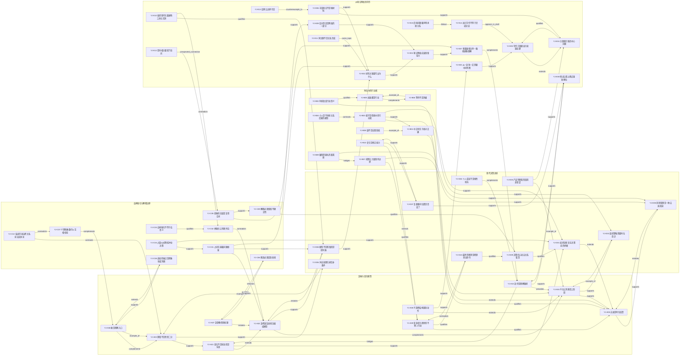

# 《易经》情境判断训练验收样例

生成时间：2026-05-15T16:15:00+08:00

这份样例用于验收研思录从随笔、文献笔记、原创笔记，到关系图谱与写作方案的完整链路。机器可读版本见 `tests/fixtures/acceptance/yijing-rich-acceptance.json`。

## 加载到测试 Vault

```powershell
node .\scripts\seed-yijing-rich-acceptance.mjs --vault <你的 vault 路径>
```

脚本会初始化目标 vault，并写入 60 条笔记、85 条显式关系、5 个索引卡、2 个写作项目和 2 个写作脚手架。重复运行是幂等的：已有样例会被刷新，不会新增重复关系。

## 数量摘要

| 随笔 | 文献笔记 | 原创笔记 | 显式关系 | 索引卡 | 写作方案 |
| --- | --- | --- | --- | --- | --- |
| 2 | 3 | 55 | 85 | 5 | 2 |

## 随笔 2 条

| ID | 标题 | 内容 |
| --- | --- | --- |
| fn_yj_001 | 看到泰卦时想到：顺利也有风险 | 今天重新看泰卦，第一反应不是顺利，而是顺利时人最容易失去边界感。所谓通泰可能只是关系暂时畅通，并不等于以后也会自然畅通。可以把它发展成一条原创笔记：顺利不是免检状态，而是更需要复盘关系是否仍然相称。 |
| fn_yj_002 | 占问像是把焦虑变成可讨论的问题 | 占问的动作本身很有意思：人先承认自己看不清，然后把一团焦虑压缩成一个可以被追问的问题。即使不把它理解为神秘预测，这个动作也有价值。也许《易经》的现代意义不在给答案，而在训练人把处境说清楚。 |

## 文献笔记 3 条

| ID | 标题 | 来源 | 转述 | 问题 |
| --- | --- | --- | --- | --- |
| ln_yj_001 | 乾坤与爻位提供情境判断的基础词汇 | 《周易》卦爻辞 | 卦爻辞并不是把一个问题直接化成答案，而是先提供情境结构：整体卦象、局部爻位、行动状态和结果评价相互配合。乾坤尤其适合做基础样本，因为它们把创生、承载、进退、边界这些问题放在同一个判断框架里。 | 同一行动为什么在不同爻位上意义不同？；乾坤是否应该被理解为互补关系，而不是强弱关系？ |
| ln_yj_002 | 变化、阴阳与通变构成易经的判断背景 | 《系辞传》 | 《系辞传》把《易》的重点从单个占辞提升到变化哲学：世界不是先稳定再偶尔变化，而是在不断变化中形成相对稳定的关系。阴阳不是两个实体阵营，而是一套互相规定、互相转化的关系词。 | 变化如果是常态，稳定性该如何重新定义？；象为什么能帮助判断，而不只是修辞？ |
| ln_yj_003 | 义理诠释提供去神秘化阅读的入口 | 王弼、程朱以来的义理诠释传统 | 义理传统提醒我们，《易经》不能只被缩减为预测技术。它也可以被读作处境判断、行动修正和德性养成的文本。这个传统并不消除象数，而是要求象数最后回到可解释、可承担的判断上。 | 去神秘化是否会损失经典的开放性？；义理解释如何避免把卦象讲成空泛道德？ |

## 原创笔记 55 条

完整正文保存在 JSON fixture 的 `original_notes[].body` 字段中。下表用于人工验收列表、详情和写作篮展示。

| ID | 标题 | 一句话论点 | 来源 | 索引 |
| --- | --- | --- | --- | --- |
| YJ-A01 | 变化不是扰动而是背景 | 变不是异常，而是所有判断默认要面对的背景。 | ln_yj_002 | idx_yj_core |
| YJ-A02 | 卦把混乱处境压缩成模型 | 卦不是答案，而是把复杂处境压缩成可讨论结构的模型。 | ln_yj_001, ln_yj_002 | idx_yj_core |
| YJ-A03 | 阴阳不是善恶二分 | 阴阳不是两个道德阵营，而是互为条件的关系结构。 | ln_yj_002 | idx_yj_core |
| YJ-A04 | 爻位让判断带上阶段 | 爻位让同一行动在不同阶段呈现不同意义。 | ln_yj_001 | idx_yj_core |
| YJ-A05 | 吉凶是时位反馈 | 吉凶不是命运判决，而是行动与时位是否相称的反馈。 | ln_yj_001 | idx_yj_core |
| YJ-A06 | 象是观察入口 | 象不是装饰性比喻，而是把抽象关系变得可观察的入口。 | ln_yj_002 | idx_yj_core |
| YJ-A07 | 卦辞像情境标题 | 卦辞更像情境标题，而不是完整结论。 | ln_yj_001 | idx_yj_core |
| YJ-A08 | 爻辞把结构落到动作 | 爻辞把卦的整体结构转化为具体行动提示。 | ln_yj_001 | idx_yj_core |
| YJ-A09 | 变卦提示趋势但不替人行动 | 变卦提示问题的发展趋势，但不能替代人的承担。 | ln_yj_001, ln_yj_003 | idx_yj_core |
| YJ-A10 | 卦序是理解路径 | 卦序可以被看作理解变化的路径，而不只是排列顺序。 | ln_yj_002 | idx_yj_core |
| YJ-B01 | 中正优先于绝对正确 | 中正比绝对正确更接近《易经》的判断观。 | ln_yj_003 | idx_yj_action |
| YJ-B02 | 时机改变行动意义 | 同一个行动在不同时间和位置上会变成不同判断。 | ln_yj_001 | idx_yj_action |
| YJ-B03 | 君子是情境中的行动者 | 《易经》中的君子不是标签，而是在时位中承担修正的人。 | ln_yj_003 | idx_yj_action |
| YJ-B04 | 小人是不承担关系后果的模型 | 小人不是固定身份，而是不愿承担关系后果的行动模式。 | ln_yj_003 | idx_yj_action |
| YJ-B05 | 进退都是行动 | 进与退都不是被动状态，而是需要判断的行动。 | ln_yj_001 | idx_yj_action |
| YJ-B06 | 等待不是消极 | 等待可以是一种保持时位敏感的积极行动。 | ln_yj_001 | idx_yj_action |
| YJ-B07 | 戒惧让力量保持边界 | 戒惧不是恐惧，而是让力量不越界的自我约束。 | ln_yj_001 | idx_yj_action |
| YJ-B08 | 谦不是自我贬低 | 谦不是否定自己，而是让能力回到合适位置。 | ln_yj_003 | idx_yj_action |
| YJ-B09 | 履险需要礼的距离感 | 面对风险时，礼提供人与危险之间的距离感。 | ln_yj_001 | idx_yj_action |
| YJ-B10 | 复归是修正能力 | 复归不是倒退，而是在偏离后重新取得判断位置。 | ln_yj_002 | idx_yj_action |
| YJ-C01 | 占问先暴露问题框架 | 占问的第一价值是暴露提问者如何框定处境。 | ln_yj_003 | idx_yj_interpretation |
| YJ-C02 | 神秘化让判断外包 | 把《易经》只当神秘预测，会把判断责任外包给答案。 | ln_yj_003 | idx_yj_interpretation |
| YJ-C03 | 去神秘化不等于去意义 | 去神秘化不是把《易经》变空，而是把意义带回判断实践。 | ln_yj_003 | idx_yj_interpretation |
| YJ-C04 | 占筮仪式降低冲动决策 | 占筮仪式至少可以被理解为延迟冲动决策的装置。 | ln_yj_003 | idx_yj_interpretation |
| YJ-C05 | 经典的含混是复用空间 | 《易经》的含混性使它能够进入多种处境，而不是只能服务单一答案。 | ln_yj_002, ln_yj_003 | idx_yj_interpretation |
| YJ-C06 | 断语必须回到处境 | 任何断语离开具体处境都会从判断变成口号。 | ln_yj_001 | idx_yj_interpretation |
| YJ-C07 | 义理和象数可以互相校验 | 义理解释和象数观察应互相校验，而不是彼此排斥。 | ln_yj_003 | idx_yj_interpretation |
| YJ-C08 | 读易的难点是把象转成判断 | 读《易》的难点不在看见象，而在把象转成可负责的判断。 | ln_yj_002 | idx_yj_interpretation |
| YJ-C09 | 解释必须保留不确定性 | 好的易经解释应保留不确定性，而不是假装已经穷尽处境。 | ln_yj_003 | idx_yj_interpretation |
| YJ-C10 | 误读常来自把关系词当实体词 | 许多误读来自把阴阳、吉凶、中正等关系词当成实体标签。 | ln_yj_002 | idx_yj_interpretation |
| YJ-D01 | 易经训练复杂决策前的停顿 | 《易经》的现代价值之一，是训练复杂决策前的停顿。 | ln_yj_003 | idx_yj_modern |
| YJ-D02 | 组织策略需要时位意识 | 组织策略不能只看目标，还要看所处阶段和位置。 | ln_yj_001 | idx_yj_modern |
| YJ-D03 | 产品判断看阶段而非愿望 | 产品判断应优先看阶段条件，而不是只看愿望强度。 | ln_yj_001 | idx_yj_modern |
| YJ-D04 | 个人成长不是线性加法 | 个人成长更像在不同处境中换位，而不是能力线性相加。 | ln_yj_002 | idx_yj_modern |
| YJ-D05 | 风险管理是一种吉凶阅读 | 风险管理可以被理解为持续阅读行动和时位是否相称。 | ln_yj_001 | idx_yj_modern |
| YJ-D06 | 冲突处理先辨互补条件 | 处理冲突时，应先辨认对立背后的互补条件。 | ln_yj_002 | idx_yj_modern |
| YJ-D07 | 复盘要问位置是否变了 | 复盘不只问做得对不对，还要问位置是否已经变化。 | ln_yj_001 | idx_yj_modern |
| YJ-D08 | 模型不是答案而是提问器 | 模型的价值不是替人回答，而是帮助人提出更清楚的问题。 | ln_yj_002 | idx_yj_modern |
| YJ-D09 | 决策信心来自关系看清 | 决策信心不来自消除不确定性，而来自看清关键关系。 | ln_yj_003 | idx_yj_modern |
| YJ-D10 | 最坏的预测是把趋势当命令 | 把趋势当成命令，是对《易经》和现代模型的共同误用。 | ln_yj_001, ln_yj_003 | idx_yj_modern |
| YJ-E01 | 笔记网络应该保留张力 | 好的笔记网络不只收集支持关系，也应保留张力和反对意见。 | 主题综合 | idx_yj_writing |
| YJ-E02 | 好的关联要写出为什么 | 笔记之间的关联必须说明为什么相关，而不能只画一条线。 | 主题综合 | idx_yj_writing |
| YJ-E03 | 从一卦到一文需要中间判断 | 从卦象到文章，中间必须经过原创判断的转换。 | ln_yj_001, ln_yj_003 | idx_yj_writing |
| YJ-E04 | 主题索引服务中心问题 | 主题索引不应只是分类，而要服务一个中心问题。 | 主题综合 | idx_yj_writing |
| YJ-E05 | 写作方案要显示来源追溯 | 写作方案必须让每个段落追溯到笔记和来源。 | ln_yj_001, ln_yj_002, ln_yj_003 | idx_yj_writing |
| YJ-E06 | 丰富笔记不是堆材料 | 笔记丰富不等于材料堆积，而是论点、理由、边界和用途都可复用。 | 主题综合 | idx_yj_writing |
| YJ-E07 | 多条路径比单一路径更像理解 | 理解《易经》更像多条路径交汇，而不是单一线性结论。 | ln_yj_002 | idx_yj_writing |
| YJ-E08 | 慢读让孤立观点重新换位 | 慢读的价值在于让旧笔记在新处境中重新换位。 | ln_yj_002 | idx_yj_writing |
| YJ-E09 | 反对意见是网络的一部分 | 反对意见不是写作障碍，而是知识网络必须保存的结构。 | 主题综合 | idx_yj_writing |
| YJ-E10 | 易经现代化要避免工具化崇拜 | 把《易经》现代化时，不能把它重新变成万能工具。 | ln_yj_003 | idx_yj_writing |
| YJ-E11 | 同主题不是关系完成 | 同属主题只说明两条笔记值得放在一起看，不能替代明确的关系判断。 | 主题综合 | idx_yj_writing |
| YJ-E12 | 意外相关要留下追问 | 看似很远的笔记只有能提出新问题，才值得标为意外相关。 | ln_yj_002 | idx_yj_writing |
| YJ-E13 | 反例让边界可见 | 反例不是破坏观点，而是让观点的适用边界变清楚。 | 主题综合 | idx_yj_writing |
| YJ-E14 | 进入写作不等于完成论证 | 一条笔记进入写作方案，只表示它被放进论证现场，还不等于已经承担了段落功能。 | 主题综合 | idx_yj_writing |
| YJ-E15 | 后续问题要声明承接关系 | 后续问题不是随意延伸，而要说明它从哪条判断自然推出。 | 主题综合 | idx_yj_writing |

## 所有关联关系

| # | From | 关系 | To | 理由 | 洞察问题 |
| --- | --- | --- | --- | --- | --- |
| 1 | YJ-A03 阴阳不是善恶二分 | supports | YJ-A01 变化不是扰动而是背景 | 阴阳互为条件，支持变化不是外部扰动而是结构背景。 | 如果阴阳是关系结构，稳定性应如何重新定义？ |
| 2 | YJ-A01 变化不是扰动而是背景 | extends | YJ-A02 卦把混乱处境压缩成模型 | 变化常态推进到卦的功能：卦把变化处境压缩成模型。 | 卦压缩了哪些信息，又保留了哪些判断线索？ |
| 3 | YJ-A02 卦把混乱处境压缩成模型 | complements | YJ-A04 爻位让判断带上阶段 | 卦给整体结构，爻位补充阶段位置，两者共同完成判断。 | 整体结构与局部阶段如何互相校验？ |
| 4 | YJ-A04 爻位让判断带上阶段 | supports | YJ-A05 吉凶是时位反馈 | 爻位说明行动要看阶段，因此支持吉凶是时位反馈。 | 哪些行动在换位之后会从吉转凶？ |
| 5 | YJ-A06 象是观察入口 | complements | YJ-A03 阴阳不是善恶二分 | 象让阴阳关系可观察，补充了抽象关系结构。 | 没有象，关系判断会失去什么？ |
| 6 | YJ-A06 象是观察入口 | example_of | YJ-A03 阴阳不是善恶二分 | 乾坤等象是阴阳互为条件的具体例子。 | 互补关系为什么容易被误读为强弱对立？ |
| 7 | YJ-A07 卦辞像情境标题 | restates | YJ-A02 卦把混乱处境压缩成模型 | 卦辞作为情境标题，是卦作为模型的另一种表达。 | 情境标题和完整结论之间的边界在哪里？ |
| 8 | YJ-A08 爻辞把结构落到动作 | extends | YJ-A04 爻位让判断带上阶段 | 爻辞把爻位阶段进一步转化为具体行动提示。 | 何时一个结构判断才能变成行动建议？ |
| 9 | YJ-A09 变卦提示趋势但不替人行动 | qualifies | YJ-A05 吉凶是时位反馈 | 变卦限定吉凶反馈：趋势提示不能变成命运判决。 | 趋势提示与主体承担之间如何划线？ |
| 10 | YJ-A10 卦序是理解路径 | bridges | YJ-A01 变化不是扰动而是背景 | 卦序把变化常态组织成可学习路径，桥接背景和次序。 | 变化是否必须被组织成顺序才能学习？ |
| 11 | YJ-A10 卦序是理解路径 | precedes | YJ-A04 爻位让判断带上阶段 | 卦序提供宏观路径，爻位判断可以在路径内部展开。 | 从卦序进入爻位还缺少哪些中间判断？ |
| 12 | YJ-B02 时机改变行动意义 | supports | YJ-A04 爻位让判断带上阶段 | 时机改变行动意义，直接支持爻位让判断带上阶段。 | 阶段意识怎样改变行动评价？ |
| 13 | YJ-B01 中正优先于绝对正确 | qualifies | YJ-A05 吉凶是时位反馈 | 中正限定吉凶阅读：不能只看结果，还要看是否相称。 | 中正是结果标准，还是位置标准？ |
| 14 | YJ-B03 君子是情境中的行动者 | extends | YJ-A05 吉凶是时位反馈 | 若吉凶是反馈，君子就是能接收反馈并修正的行动者。 | 行动者如何把反馈转化为下一步？ |
| 15 | YJ-B04 小人是不承担关系后果的模型 | contrasts | YJ-B03 君子是情境中的行动者 | 小人作为不承担后果的模式，与君子行动者形成对照。 | 身份标签化会如何遮蔽行动模式？ |
| 16 | YJ-B05 进退都是行动 | complements | YJ-B06 等待不是消极 | 进退都是行动，补充说明等待也可能是主动判断。 | 什么时候等待比推进更有判断含量？ |
| 17 | YJ-B06 等待不是消极 | example_of | YJ-B05 进退都是行动 | 等待是退或守也可以成为行动的具体例子。 | 等待如何区别于拖延？ |
| 18 | YJ-B07 戒惧让力量保持边界 | qualifies | YJ-A09 变卦提示趋势但不替人行动 | 戒惧让趋势提示不被误用为冒进命令。 | 力量越大时，为什么越需要边界？ |
| 19 | YJ-B08 谦不是自我贬低 | example_of | YJ-B01 中正优先于绝对正确 | 谦让能力回到合适位置，是中正观的例子。 | 谦如何避免变成自我贬低？ |
| 20 | YJ-B09 履险需要礼的距离感 | bridges | YJ-B07 戒惧让力量保持边界 | 履险用礼保持距离，桥接戒惧和风险处置。 | 礼在风险场景中如何成为距离管理？ |
| 21 | YJ-B10 复归是修正能力 | extends | YJ-A09 变卦提示趋势但不替人行动 | 复归把趋势提示推进为偏离后的修正能力。 | 发现趋势之后，怎样重新取得位置？ |
| 22 | YJ-B10 复归是修正能力 | supports | YJ-D07 复盘要问位置是否变了 | 复归支持复盘要检查位置是否变化。 | 复盘如何避免只评价动作本身？ |
| 23 | YJ-B03 君子是情境中的行动者 | supports | YJ-B01 中正优先于绝对正确 | 君子行动者以中正为调整方向，而非追求绝对正确。 | 行动者如何在不确定中保持中正？ |
| 24 | YJ-B02 时机改变行动意义 | qualifies | YJ-B05 进退都是行动 | 时机限定进退意义：进退是否合适取决于阶段。 | 同样的退让为什么在不同阶段意义不同？ |
| 25 | YJ-C01 占问先暴露问题框架 | reframes | YJ-A02 卦把混乱处境压缩成模型 | 占问把卦从答案重构为问题框架和情境模型。 | 问题框架是否比答案本身更重要？ |
| 26 | YJ-C01 占问先暴露问题框架 | supports | YJ-D08 模型不是答案而是提问器 | 占问暴露问题框架，支持模型是提问器的理解。 | 模型怎样帮助人问得更清楚？ |
| 27 | YJ-C02 神秘化让判断外包 | contradicts | YJ-A02 卦把混乱处境压缩成模型 | 神秘化把卦当答案，反驳卦是模型的判断路径。 | 神秘化为什么会削弱模型功能？ |
| 28 | YJ-C03 去神秘化不等于去意义 | qualifies | YJ-C02 神秘化让判断外包 | 去神秘化限定神秘化批评：不是去意义，而是拒绝外包判断。 | 如何保留敬畏又不取消责任？ |
| 29 | YJ-C04 占筮仪式降低冲动决策 | supports | YJ-C01 占问先暴露问题框架 | 占筮仪式让人停顿并提问，支持占问暴露问题框架。 | 仪式如何把冲动改造成判断？ |
| 30 | YJ-C05 经典的含混是复用空间 | supports | YJ-E07 多条路径比单一路径更像理解 | 经典含混提供多处境复用空间，支持多路径理解。 | 开放性需要哪些解释纪律？ |
| 31 | YJ-C06 断语必须回到处境 | qualifies | YJ-A07 卦辞像情境标题 | 断语回到处境，限定卦辞不能被当作脱离时位的口号。 | 短句怎样避免格言化误读？ |
| 32 | YJ-C07 义理和象数可以互相校验 | complements | YJ-A06 象是观察入口 | 义理让象回到意义，象让义理避免空泛，两者互补。 | 象数和义理怎样互相校验？ |
| 33 | YJ-C08 读易的难点是把象转成判断 | extends | YJ-A06 象是观察入口 | 把象转成判断，是象作为观察入口之后的下一步。 | 形象联想如何转成行动边界？ |
| 34 | YJ-C09 解释必须保留不确定性 | qualifies | YJ-D09 决策信心来自关系看清 | 解释保留不确定性，限定决策信心不能等同于绝对确定。 | 看清关系和消除不确定性有什么区别？ |
| 35 | YJ-C10 误读常来自把关系词当实体词 | contrasts | YJ-A03 阴阳不是善恶二分 | 把关系词实体化，与阴阳作为关系结构形成对比。 | 哪些词最容易被实体化？ |
| 36 | YJ-C10 误读常来自把关系词当实体词 | contradicts | YJ-C07 义理和象数可以互相校验 | 实体化误读会破坏义理和象数的互相校验。 | 关系词被实体化后，解释会失去什么？ |
| 37 | YJ-D01 易经训练复杂决策前的停顿 | extends | YJ-A05 吉凶是时位反馈 | 复杂决策前的停顿，把吉凶反馈转化为现代行动流程。 | 停顿如何帮助重新阅读时位？ |
| 38 | YJ-D02 组织策略需要时位意识 | example_of | YJ-A04 爻位让判断带上阶段 | 组织策略的阶段意识，是爻位判断在组织场景中的例子。 | 组织何时该进，何时该守？ |
| 39 | YJ-D03 产品判断看阶段而非愿望 | example_of | YJ-A04 爻位让判断带上阶段 | 产品阶段判断是爻位意识在产品实践中的例子。 | 产品愿望如何被阶段条件限制？ |
| 40 | YJ-D04 个人成长不是线性加法 | complements | YJ-A10 卦序是理解路径 | 个人成长的换位意识补充卦序作为理解路径。 | 成长为什么不是简单累加？ |
| 41 | YJ-D05 风险管理是一种吉凶阅读 | restates | YJ-A05 吉凶是时位反馈 | 风险管理把吉凶反馈改写为现代语言。 | 风险阅读怎样发现吉转凶的条件？ |
| 42 | YJ-D06 冲突处理先辨互补条件 | example_of | YJ-A03 阴阳不是善恶二分 | 冲突处理中辨互补条件，是阴阳关系结构的现代例子。 | 冲突双方何时不是零和关系？ |
| 43 | YJ-D07 复盘要问位置是否变了 | supports | YJ-B10 复归是修正能力 | 复盘检查位置变化，支持复归作为修正能力。 | 位置变化如何改变复盘结论？ |
| 44 | YJ-D08 模型不是答案而是提问器 | restates | YJ-A02 卦把混乱处境压缩成模型 | 模型是提问器，重述了卦不是答案而是情境模型。 | 什么时候模型会被误用成答案？ |
| 45 | YJ-D09 决策信心来自关系看清 | qualifies | YJ-D01 易经训练复杂决策前的停顿 | 决策信心来自看清关系，限定停顿不是为了追求完全确定。 | 停顿到什么程度就足够行动？ |
| 46 | YJ-D10 最坏的预测是把趋势当命令 | contradicts | YJ-A09 变卦提示趋势但不替人行动 | 把趋势当命令，反驳变卦只提示趋势不替人行动。 | 趋势判断何时会取消主体承担？ |
| 47 | YJ-D10 最坏的预测是把趋势当命令 | qualifies | YJ-D09 决策信心来自关系看清 | 趋势不能替代判断，限定决策信心必须保留责任边界。 | 看清趋势是否一定增加信心？ |
| 48 | YJ-E01 笔记网络应该保留张力 | supports | YJ-E07 多条路径比单一路径更像理解 | 保留张力能形成多条理解路径，而非单一路径。 | 哪些张力应被保留在图谱中？ |
| 49 | YJ-E02 好的关联要写出为什么 | supports | YJ-E01 笔记网络应该保留张力 | 好的关联说明为什么相关，支持图谱保留真实张力。 | 没有理由的关系线会制造什么误导？ |
| 50 | YJ-E03 从一卦到一文需要中间判断 | supports | YJ-E05 写作方案要显示来源追溯 | 从卦到文需要中间判断，支持写作方案必须追溯来源。 | 段落追溯如何防止文章漂浮？ |
| 51 | YJ-E04 主题索引服务中心问题 | qualifies | YJ-E05 写作方案要显示来源追溯 | 中心问题限定写作方案如何选择和组织来源追溯。 | 一个主题索引如何转成写作项目？ |
| 52 | YJ-E05 写作方案要显示来源追溯 | extends | YJ-E04 主题索引服务中心问题 | 来源追溯把主题索引进一步推进为段落骨架。 | 哪些段落最需要清楚追溯？ |
| 53 | YJ-E06 丰富笔记不是堆材料 | supports | YJ-E04 主题索引服务中心问题 | 丰富笔记具备可复用判断，支持主题索引服务中心问题。 | 材料丰富和判断丰富如何区分？ |
| 54 | YJ-E07 多条路径比单一路径更像理解 | complements | YJ-A10 卦序是理解路径 | 多路径理解补充卦序路径，避免把顺序理解成唯一道路。 | 线性路径和网络路径如何共存？ |
| 55 | YJ-E08 慢读让孤立观点重新换位 | supports | YJ-A10 卦序是理解路径 | 慢读让卦序和旧笔记在新处境中重新排列。 | 重读为什么会改变旧笔记的位置？ |
| 56 | YJ-E09 反对意见是网络的一部分 | supports | YJ-E01 笔记网络应该保留张力 | 反对意见作为网络结构，支持笔记网络保留张力。 | 反对意见应如何进入写作骨架？ |
| 57 | YJ-E10 易经现代化要避免工具化崇拜 | qualifies | YJ-D08 模型不是答案而是提问器 | 反工具化限定模型提问器：模型不能被崇拜成万能工具。 | 现代化如何避免换一种方式制造答案机器？ |
| 58 | YJ-E10 易经现代化要避免工具化崇拜 | contradicts | YJ-C02 神秘化让判断外包 | 现代化若避免工具崇拜，就反驳神秘化式外包判断。 | 工具化崇拜和神秘化有什么共同点？ |
| 59 | YJ-E11 同主题不是关系完成 | same_topic | YJ-E02 好的关联要写出为什么 | 两条笔记都讨论关系质量，但同主题只说明应继续比较，还没有说明具体支持、限定或反驳。 | 什么时候同主题关系应该升级为更明确的关系类型？ |
| 60 | YJ-E12 意外相关要留下追问 | unexpected_connection | YJ-C05 经典的含混是复用空间 | 经典含混与笔记网络的意外连接都依赖开放性，但意外相关必须提出可追问的问题。 | 开放性什么时候产生洞见，什么时候变成任意联想？ |
| 61 | YJ-E13 反例让边界可见 | counterexample_to | YJ-E06 丰富笔记不是堆材料 | 只堆支持材料的笔记是丰富笔记的反例，因为它缺少边界和反对意见。 | 一条笔记需要多少反例才足以显示边界？ |
| 62 | YJ-E14 进入写作不等于完成论证 | appears_in_draft | YJ-E05 写作方案要显示来源追溯 | 进入写作方案后，笔记仍需通过来源追溯说明它在段落中的论证位置。 | 写作篮里哪些材料只是待用，哪些已经承担论证？ |
| 63 | YJ-E15 后续问题要声明承接关系 | follows | YJ-E14 进入写作不等于完成论证 | 确认笔记进入写作之后，后续问题是说明它如何承接前文并推出下一段。 | 后续关系如何防止文章段落跳跃？ |
| 64 | YJ-A01 变化不是扰动而是背景 | supports | YJ-D01 易经训练复杂决策前的停顿 | 变化作为背景，支持现代决策前先停顿重看处境。 | 变化常态如何改变决策节奏？ |
| 65 | YJ-A02 卦把混乱处境压缩成模型 | supports | YJ-D08 模型不是答案而是提问器 | 卦作为模型，支持模型应被当作提问器。 | 提问器和答案机器的界线如何展示给用户？ |
| 66 | YJ-A03 阴阳不是善恶二分 | supports | YJ-D06 冲突处理先辨互补条件 | 阴阳互为条件，支持冲突处理中先辨互补条件。 | 对立双方如何互相规定？ |
| 67 | YJ-A04 爻位让判断带上阶段 | supports | YJ-D02 组织策略需要时位意识 | 爻位阶段意识，支持组织策略的时位意识。 | 组织策略怎样避免阶段错配？ |
| 68 | YJ-A05 吉凶是时位反馈 | supports | YJ-D05 风险管理是一种吉凶阅读 | 吉凶作为反馈，支持风险管理是一种关系阅读。 | 优势何时会变成风险？ |
| 69 | YJ-A06 象是观察入口 | supports | YJ-C08 读易的难点是把象转成判断 | 象作为观察入口，支持读易难点在把象转成判断。 | 观察形态如何产生判断责任？ |
| 70 | YJ-A07 卦辞像情境标题 | supports | YJ-C06 断语必须回到处境 | 卦辞像标题，支持断语必须回到处境。 | 压缩语言如何避免过度解释？ |
| 71 | YJ-A08 爻辞把结构落到动作 | supports | YJ-E03 从一卦到一文需要中间判断 | 爻辞把结构落到动作，支持从一卦到一文需要中间判断。 | 行动提示怎样进入文章段落？ |
| 72 | YJ-A09 变卦提示趋势但不替人行动 | qualifies | YJ-D10 最坏的预测是把趋势当命令 | 变卦只提示趋势，限定趋势不能被当作命令。 | 趋势提示何时变成行动绑架？ |
| 73 | YJ-A10 卦序是理解路径 | supports | YJ-E08 慢读让孤立观点重新换位 | 卦序作为路径，支持慢读时旧观点可以重新换位。 | 路径理解如何在重读中变化？ |
| 74 | YJ-B01 中正优先于绝对正确 | supports | YJ-D02 组织策略需要时位意识 | 中正优先于绝对正确，支持组织策略看阶段和相称。 | 组织中的中正如何被操作化？ |
| 75 | YJ-B03 君子是情境中的行动者 | supports | YJ-D01 易经训练复杂决策前的停顿 | 君子作为承担者，支持复杂决策停顿后仍要行动。 | 停顿之后谁来承担选择？ |
| 76 | YJ-B07 戒惧让力量保持边界 | supports | YJ-D05 风险管理是一种吉凶阅读 | 戒惧让力量保持边界，支持风险管理持续阅读时位。 | 边界感如何降低优势误用？ |
| 77 | YJ-C01 占问先暴露问题框架 | supports | YJ-E03 从一卦到一文需要中间判断 | 占问暴露问题框架，支持从材料到文章必须经过中间判断。 | 问题框架怎样变成文章主线？ |
| 78 | YJ-C05 经典的含混是复用空间 | supports | YJ-C09 解释必须保留不确定性 | 经典含混提供复用空间，也支持解释时必须保留不确定性。 | 复用空间如何避免任意解释？ |
| 79 | YJ-C09 解释必须保留不确定性 | supports | YJ-E09 反对意见是网络的一部分 | 解释保留不确定性，支持反对意见成为网络的一部分。 | 不确定性如何在文章中被诚实呈现？ |
| 80 | YJ-D03 产品判断看阶段而非愿望 | supports | YJ-E04 主题索引服务中心问题 | 产品阶段判断提供中心问题样例，支持主题索引服务写作问题。 | 产品场景如何筛选易经笔记？ |
| 81 | YJ-D07 复盘要问位置是否变了 | supports | YJ-E08 慢读让孤立观点重新换位 | 复盘检查位置变化，支持慢读让观点重新换位。 | 复盘和慢读有什么共同结构？ |
| 82 | YJ-D08 模型不是答案而是提问器 | supports | YJ-E02 好的关联要写出为什么 | 模型作为提问器，支持关联说明必须写出为什么。 | 一条关系线应回答什么问题？ |
| 83 | YJ-E06 丰富笔记不是堆材料 | supports | YJ-E02 好的关联要写出为什么 | 丰富笔记要求论点、理由和用途可复用，支持关联必须写出为什么。 | 笔记自身的丰富度如何影响关系质量？ |
| 84 | YJ-B09 履险需要礼的距离感 | supports | YJ-D05 风险管理是一种吉凶阅读 | 履险中的距离感支持风险管理要持续阅读边界。 | 风险管理如何把礼转化为操作性边界？ |
| 85 | YJ-C04 占筮仪式降低冲动决策 | supports | YJ-D01 易经训练复杂决策前的停顿 | 占筮仪式的停顿机制支持复杂决策前先暂停和框定问题。 | 仪式性停顿能否被现代工作流吸收？ |

## 图谱



## 写作方案示例

### 为什么《易经》不是答案机器

- 写作目标：写一篇面向普通知识读者的解释型长文，说明《易经》的现代价值在情境判断训练。
- 目标读者：对《易经》好奇、但担心它只是玄学预测的读者
- 写作意图：去神秘化但不去意义，把读者从求答案带到练判断。
- 读者带走的判断：读者读完后应接受：卦象、爻位、吉凶和占问共同构成的是判断训练，而不是自动答案。
- 材料篮：YJ-A01, YJ-A02, YJ-A04, YJ-A05, YJ-A09, YJ-B03, YJ-C01, YJ-C02, YJ-C03, YJ-D08, YJ-E10

| 段落 | 摘要 | 笔记追溯 | 文献追溯 |
| --- | --- | --- | --- |
| 从求答案开始，但不要停在答案 | 用占问暴露问题框架开场，说明用户真正需要的是更清楚的处境。 | YJ-C01, YJ-D08 | ln_yj_003 |
| 卦是情境模型，不是结论机器 | 解释卦、卦辞和爻位如何把混乱处境压缩成结构。 | YJ-A01, YJ-A02, YJ-A04 | ln_yj_001, ln_yj_002 |
| 吉凶是反馈，变卦不是命令 | 把吉凶读成行动与时位是否相称的反馈，并说明趋势不替人负责。 | YJ-A05, YJ-A09, YJ-B03 | ln_yj_001 |
| 去神秘化不是把意义清空 | 回应神秘化误读，说明去神秘化是把意义带回可承担的判断。 | YJ-C02, YJ-C03, YJ-E10 | ln_yj_003 |

### 从时位到复盘：把《易经》变成现代判断训练

- 写作目标：写一篇面向产品、组织和知识工作者的实践型文章。
- 目标读者：需要在复杂项目、组织变化和个人选择中做判断的读者
- 写作意图：把时位、关系反馈、复归和慢读转化为现代决策流程。
- 读者带走的判断：读者应获得一套可实践的判断流程：停顿、框定问题、辨认位置、行动、复盘换位。
- 材料篮：YJ-B01, YJ-B02, YJ-B05, YJ-B06, YJ-B10, YJ-D01, YJ-D02, YJ-D03, YJ-D05, YJ-D07, YJ-E05, YJ-E08

| 段落 | 摘要 | 笔记追溯 | 文献追溯 |
| --- | --- | --- | --- |
| 复杂决策先停顿 | 说明停顿不是拖延，而是重新看见时位和关系。 | YJ-D01, YJ-B06 | ln_yj_003 |
| 判断行动前先判断位置 | 用组织和产品例子说明阶段错配比意愿不足更常见。 | YJ-B02, YJ-D02, YJ-D03 | ln_yj_001 |
| 风险阅读：优势也会错位 | 把吉凶反馈转成风险管理语言，强调戒惧和边界。 | YJ-B01, YJ-B05, YJ-D05 | ln_yj_001, ln_yj_002 |
| 复盘与慢读让判断重新换位 | 把复归、复盘和慢读连接成持续修正机制。 | YJ-B10, YJ-D07, YJ-E08, YJ-E05 | ln_yj_002 |

## 验收建议

- 导入或加载 fixture 后，应能看到 55 个原创节点和 85 条显式关系。
- 关系筛选应能区分 `supports`、`qualifies`、`contradicts`、`counterexample_to`、`same_topic`、`unexpected_connection`、`appears_in_draft` 等类型。
- 从 `YJ-A02`、`YJ-A05`、`YJ-D08`、`YJ-E05` 任一中心节点进入，侧边关系和图谱都应显示多跳路径。
- 写作方案中的每个段落都必须能追溯到原创笔记和文献笔记。
